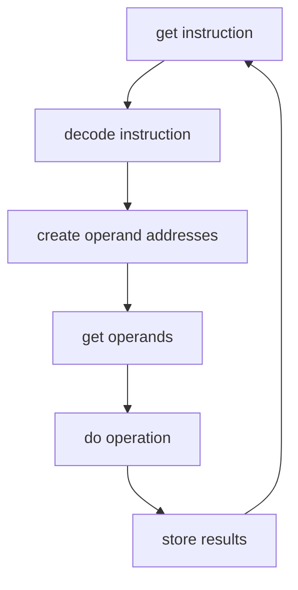

# Chapter 1 Review Questions

1. Explain in your own words the differences between computer systems architecture and implementation. How are these concepts distinct, yet interrelated? Give a historical example of how implementation technology has affected architectural design (or vice versa).

ANSWER

> Architecture is the design of a computer system,        whereas implementation is a working computer system. Architectural vision affects the type of technologies chosen for implementation, and implementation technologies can broaden the scope of design.

> Implementation technology in the form of solid-state transistors, invented in 1947, paved the way for many architectural enhancements. In particular, the mean time between failures (MTBF) was drastically reduced. Thus, machines could be more complex and have more features than their predecessors without breaking down as often.

2. Describe the technologies used to implement computers of the first, second, third, fourth, fifth, and sixth generations. What were the main new architectural features that were introduced or popularized with each generation of machines? What advances in software went along with each new generation of hardware?

ANSWER

| generation | implementation technologies | architectural features | software advances |
| --- | --- | --- | --- |
| 1st | electromagnetic relays, vaccuum tubes | stored-program design allowed for software | similar to modern pocket calculators |
| 2nd | solid-state transistors | general purpose registers used for arithmetic or addressing, virtual memory, asynchronous I/O controlled by independent parallel processors, hardware interrupts | batch-processing (programs were loaded and executed automatically by the system) and multiprogramming (more than one program resident in memory at the same time) operating systems, Fortran, Algol, and COBOL (machine languages) were developed |
| 3rd | integrated circuits | minicomputers led by Digital Equipment Corporation (DEC) brought to market, and supercomputers designed, some with heavily pipelined architecture, families of computers | advent of time-sharing operating systems, virtual memory became common,  new, more efficient computer langages were developed (like B in 1970) |
| 4th | LSI (large-scale integration) and VLSI (very large-scale integration) circuits, led to microprocessors, a CPU on one chip, semiconductor main memory made of VLSI RAM and ROM devices | the microcomputer was developed, increasing access to computers for the general public. the Apple II and IBM Personal Computer (PC) were released. | word processing, database management, and spreadsheet programs released, direct support for high level languages, optimized compilers |
| 5th | processors became more internally parallel, clock speeds increased. high-speed low cost graphics cards, term GPU coined by NVIDIA | architecture was designed to be connected to wired and/or wireless local area or wide area networks (LANs and WANs) and the internet | network capabilities integrated into Apple and Microsoft OS. Java designed with networked environment in mind. 
| 6th | billions of transistors on chip, RAM size and data transfer rates increased, hard drive capacity increased | ever larger on-chip cache and additional processing cores led to essentially single-chip multiprocessor systems, mobile devices such as smartphones and tablets developed, cloud computing | application languages and operating systems for mobile devices developed, big data processsing |

3. What characteristics do you think the next generation of computers (for example, 5-10 years from now) will display?

ANSWER

> I believe mobile devices and notebooks will replace all workstation computers, utilizing the implementation technology of cloud computing to create powerful systems requiring the minimum in local infrastructure. Software will grow increasingly individualized as big data coupled with machine learning generates personal algorithms for users. 

4. What was the main architectural difference between the two early computers ENIAC and EDVAC?

ANSWER

>ENIAC connections had to be rewired by hand in order to program different calculations. EDVAC ran software, and was designed to perform sequential processing of instructions that were stored in memory with data: characteristics that would become the von Neumann architecture.

5. Why was the invention of solid-state electronics (in particular, the transistor) so important in the history of computer architecture?

ANSWER

>Solid-state transistors allowed the total number of switching elements to increase, leading to single-chip processors, and later single-chip multiprocessor systems. Processing power continues to increase even as clock frequencies have leveled off.

6. Explain the origin of the term core dump.

ANSWER

> As core memory became extinct, its legacy survived in the term core dump, which refers to the contents of the main memory logged for diagnostic purposes when a crash occurs. 

7. What technological advances allowed the development of minicomputers, and what was the significance of this class of machines? How is a microcomputer different from a minicomputer?

ANSWER

>Integrated circuits replacing discrete transistors allowed semiconductor chips to hold an entire register, adder, or even arithmetic logic unit (ALU). This class of machines meant that rather than an organization having a single central computer shared among a large number of users, small departments or even individual workers could have their own machines, creating the concept of workstation computer. Microcomputers were available such that almost anyone could have a computer. Microcomputers were smaller and cheaper than minicomputers.

8. How have the attributes of very high performance systems (aka supercomputers) changed over the third, fourth, fifth, and sixth generations of computing?

ANSWER

> The third generation had the first of the supercomputers, such as the CDC 6600. Vector processors with heavily pipelined architecture and the first high-performance parallel processing machines were developed.

> The fourth generation saw the debut of highly parallel supercomputers, and supercomputers became increasingly powerful and widely used. Direct support for high level languages in hardware was introduced in machines of all descriptions, such as the Complex Instruction Set Computer (CISC) architecture. 

> The fifth generation saw supercomputing move away from the expensive high-speed pipelined vector processors, and more commonly see nonvector, massively parallel microprocessor based systems. The vast majority of the Top 500 were highly parallel scalar machines, and networking became a serious consideration.

> The sixth generation saw the concept of cloud computing architectures brought to reality. GPUs began to supplement traditional CPUs in handling certain demanding computing jobs. 

9. What is the most significant difference between computers of the past 10 to 15 years versus those of previous generations?

ANSWER

> The proliferation of connectivity: between the internet, bluetooth, LANs, and WANs; users expect to be able to connect and share data with a variety of other users and other devices.

10. What is the principal performance limitation of a machine based on the von Neumann (Princeton) architecture? How does a Harvard architecture address this limitation?

ANSWER

> The principal performance limitation is the von Neumann bottleneck - the single path to memory for accessing both instructions and data. The Harvard architecture addresses this limitation by providing separate memories and buses for instructions and data. 

11. Summarize in your own words the von Neumann machine cycle. 

ANSWER

get instruction -> decode instruction -> create operand addresses -> get operands -> do operation -> store results ->

12. Does a computer system with high generality tend to have higher quality than other systems? Explain.

ANSWER

> Generality is a problematic aspect of quality as it is not always good or bad. The breadth of applications to be run on a particular system defines how general its architecture and implementation should be. Generality affects cost, as a machine that appeals to a wider audience is more marketable. A general architecture leads to a more complex implementation, and as complexity increases, the more things can go wrong. 

13. How does ease of use relate to user-friendliness?

ANSWER

> Ease-of-use is referenced from a system programmer's POV, while user-friendliness is referenced from an applications programmer or end-user's POV. 

14. The obvious benefit of maintaining upward and/or forward compatibility is the ability to run legacy code. What are some disadvantages of compatibility?

ANSWER

> Upward and/or forward compatibility complicates the design process, potentially making the system costlier and less reliable. A complex architecture is more likely to hide flaws. Compatibility may be at cross purposes with ease of use.

15. Name at least two things (other than hardware purchase price, software licensing cost, maintenance, and support) that may be considered cost factors for a computer system. 

ANSWER

> Electricity, battery life, heat, and reliability. 

16. Give as many reasons as you can why PC-compatible computers have a larger market share than Macs.

ANSWER

> PC's specifications were open and available, becoming industry standards. PC compatible 'clones' were made by a large number of manufacturers, leading to a lower price and higher quality.

17. One computer system has a 3.2 GHz processor, and another has only a 2.7 GHz processor. Is it possible that the second sytem might outperform the first? Explain.

ANSWER

> The second procesor may have access to more RAM, leading to outperformance of the first processor even with its higher frequency. 

18. A computer system of interest has a CPU with a clock cycle time of .5 ns. Machine language instruction types for this system include integer addition/subtraction/logic instructions that require one clock cycle to be executed, data transfer instructions that average two clock cycles to be executed, control transfer instructions that average three clock cycles to be executed, floating-point arithmetic instructions that average five clock cycles to be executed, and input/output instructions that average two clock cycles to be executed.
    1. Suppose you are a marketing executive who wants to hype the performance of this system. Determine its peak MIPS rating for use in your ads. 

    

ANSWER

    

    $$
    \mathrm{clock \ cycle} = .5 \ \mathrm{ns}
    $$

    $$
    \mathrm{integer \ instructions} = 1 \ \mathrm{clock \ cycle}
    $$

    $$
    \frac{1 \ \mathrm{instruction}}{.5 \ \mathrm{ns}} = \frac{2 \ \mathrm{instruction}}{1 \ \mathrm{ns}}
    $$

    > Then multiply by 1 billion for nanosecond conversion,

    $$
    2000000000 \ \frac{\mathrm{instructions}}{\mathrm{second}}
    $$

    > Divide by 1 million such that,

    $$
    2000 \ \mathrm{MIPS}
    $$

    

    

    2. Suppose you have acquired this system and want to estimate its performance when running a particular program. You analyze the compiled code for this program and determine that it consists of 40% data transfer instructions; 35% integer addition, subtraction and logical instructions; 15% control transfer instructions, and 10% I/O instructions. What MIPS rating do you expect the system to achieve while running this program?

    

ANSWER

    

    $$
    \mathrm{clock \ cycle} = .5 \ \mathrm{ns}
    $$

    > We need to find how many clock cycles the average instruction takes to be executed:

    $$
    .4(2) + .35(1) + .15(3) + .1(2)
    $$

    $$
    = .8 + .35 + .45 + .2 = 1.8 \ \mathrm{clock \ cycles}
    $$

    > We need to find the average time to complete an instruction:

    $$
    1.8 * .5 \ \mathrm{ns} = .9 \ \mathrm{ns} = \frac{1 \ \mathrm{instruction}}{.9 \ \mathrm{ns}}
    $$

    > Convert from nanoseconds to seconds (multiply by 1 billion):

    $$
    \frac{1 \ \mathrm{instruction}}{.9 \ \mathrm{ns}} = 900000000 \ \frac{\mathrm{instructions}}{\mathrm{s}}
    $$

    > Convert to MIPS (divide by 1 million):

    $$
    900000000 \ \frac{\mathrm{instructions}}{\mathrm{s}} = 900 \ \mathrm{MIPS}
    $$

    
 
    

    3. Suppose you are considering purchasing this system to run a variety of programs using mostly floating-point arithmetic. Of the widely used benchmark suites discussed in this chapter, which would be the best to use in comparing this system to others you are considering?

    

ANSWER

    

    > LINPACK would be of great use, as it solves a large system of simultaneous equations with floating-point coefficients. Livermore Loops would also be beneficial, as it executes 24 Fortran loops on floating-point data sets.

    
 
    

    4. What does MFLOPS stand for? Estimate this system's MFLOPS rating. Justify your answer with reasoning and calculations.

    

ANSWER

    

    > Millions of floating point operations per second. 

    $$
    \mathrm{clock \ cycle} = .5 \ \mathrm{ns}
    $$

    $$
    \mathrm{floating \ point \ instructions} = 5 \ \mathrm{clock \ cycles}
    $$

    $$
    5 * .5 \ \mathrm{ns} = \frac{1 \ \mathrm{FLOP}}{2.5 \ \mathrm{ns}} 
    $$

    > Multiply by 1 million to get MFLOP: 

    $$
    \frac{1 \ \mathrm{FLOP}}{2.5 \ \mathrm{ns}} = \frac{1000000 \ \mathrm{FLOP}}{2500000 \ \mathrm{ns}} = \frac{1 \ \mathrm{MFLOP}}{2500000 \ \mathrm{ns}}
    $$

    > Convert to seconds:

    $$
    2500000 \ \mathrm{ns} = .0025 \ \mathrm{s} = \frac{1 \ \mathrm{MFLOP}}{.0025 \ \mathrm{s}} = 400 \ \mathrm{MFLOPS}
    $$

    
 
    

19. Why does a hard disk that rotates at higher RPM generally outperform one that rotates at lower RPM? Under what circumstances might this not be the case?

ANSWER

> Latency, rotational delay required for the disk to get to the right position to start accessing information, slows down read/write data operations.
> The lower RPM disk may outperform the other if the bus allows for more memory to be transferred at a time. For instance, a higher RPM disk that allows 8-bit transfers would likely underperform a lower RPM disk that allows 64-bit transfers.

 

20. A memory system can read or write a 64-bit value every 2 ns. Express its bandwidth in megabytes per second. 

ANSWER

> Memory bandwidth can be defined as the number of bytes that can be transferred per unit of time. The cycle time of the memory tells us how frequently we can transfer data to or from the memory. 

$$
\mathrm{bandwidth} = 64 \ \mathrm{bits} \ \mathrm{per} \ 2 \ \mathrm{ns} = \frac{64 \ \mathrm{bits}}{2 \ \mathrm{ns}}
$$

$$
1 \ \mathrm{byte} = 8 \ \mathrm{bit}
$$

$$
8 \ \mathrm{bytes} = 64 \ \mathrm{bits}
$$

> Thus, 

$$
\frac{64 \ \mathrm{bits}}{2 \ \mathrm{ns}} = \frac{8 \ \mathrm{bytes}}{2 \ \mathrm{ns}} = \frac{4 \ \mathrm{bytes}}{1 \ \mathrm{ns}} = 4 \ \frac{\mathrm{bytes}}{\mathrm{ns}}
$$

$$
4 \ \frac{\mathrm{bytes}}{\mathrm{ns}} = 4000000000 \ \frac{\mathrm{bytes}}{\mathrm{s}} = 4000 \ \frac{\mathrm{megabytes}}{\mathrm{s}} = 4000 \ \mathrm{MB}
$$

> or,

$$
\mathrm{bandwidth} = 8 \ \mathrm{bytes} \ \mathrm{per} \ 2 \ \mathrm{ns} = \frac{8 \ \mathrm{bytes}}{2 \ \mathrm{ns}}
$$

$$
\frac{1 \ \mathrm{second}}{2 \ \mathrm{ns}} = 500000000 
$$

$$
500000000 * 8 \ \mathrm{bytes} = 4000000000 \ \frac{\mathrm{bytes}}{\mathrm{s}} = 4000 \ \frac{\mathrm{megabytes}}{\mathrm{s}}
$$

 

21. If a manufacturer's brochure states that a given system can perform I/O operations at 1500 MB/s, what questions would you like to ask the manufacturer's representative regarding this claim?

ANSWER

> Was this speed achieved while doing a few large block transfers? If so, did the tranfers overflow device buffers? What is the optimum block size for data transfers?

 

22. Fill in the blanks below with the most appropriate term or concept discussed in this chapter:

_____________ The actual, physical realization of a computer system as opposed to the conceptual or block-level design

_____________ This was the first design for a programmable digital computer, but a working model was never completed.

_____________ This technological development was an important factor in moving from second-generation to third-generation computers

_____________ This system is widely considered to have been the first supercomputer.

_____________ This early microcomputer kit was based on an 8 bit microprocessor; it introduced 10,000 hobbyists to (relatively) inexpensive personal computing.

_____________ This type of computer is embedded inside another elctronic or mechanical device, such as a cellular telephone, microwave oven, or automobile transmission.

_____________ A type of computer system design in which the CPU uses separate memory buses for accessing instructions and data operands.

_____________ An architectural attribute that expresses the support provided for previous or other architectures by the current machine. 

_____________ A CPU performance index that measures the rate at which computations can be performed on real numbers rather than integers.

_____________ A measure of memory or I/O performance that tells how much data can be transferred to or from a device per unit of time.

_____________ A program or set of programs that are used as standardized means of comparing the performance of different computer systems.

ANSWER

<u>implementation</u> | The actual, physical realization of a computer system as opposed to the conceptual or block-level design

<u>Babbage's Analytical Engine</u> | This was the first design for a programmable digital computer, but a working model was never completed.

<u>integrated circuits</u> | This technological development was an important factor in moving from second-generation to third-generation computers

<u>CDC 6600</u> | This system is widely considered to have been the first supercomputer.

<u>Altair computer kit</u> | This early microcomputer kit was based on an 8 bit microprocessor; it introduced 10,000 hobbyists to (relatively) inexpensive personal computing.

<u>microcontroller</u> | This type of computer is embedded inside another elctronic or mechanical device, such as a cellular telephone, microwave oven, or automobile transmission.

<u>Harvard architecture</u> | A type of computer system design in which the CPU uses separate memory buses for accessing instructions and data operands.

<u>compatibility</u> | An architectural attribute that expresses the support provided for previous or other architectures by the current machine. 

<u>FLOPS (MFLOPS, GFLOPS, etc.)</u> | A CPU performance index that measures the rate at which computations can be performed on real numbers rather than integers.

<u>bandwidth</u> | A measure of memory or I/O performance that tells how much data can be transferred to or from a device per unit of time.

<u>benchmark</u> | A program or set of programs that are used as standardized means of comparing the performance of different computer systems.

 

