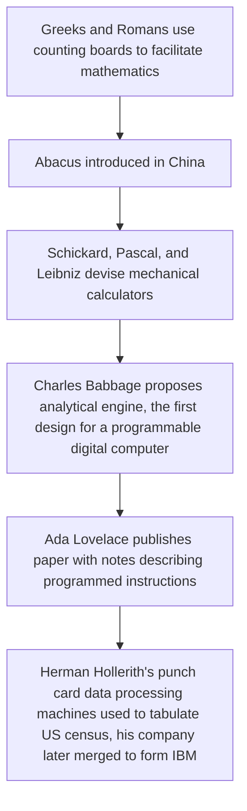

# Chapter 1: Introduction

## 1.1 What is Computer Architecture?
Computer Architecture is the design of computer systems, including all of their major subsystems: the central processing unit (CPU), the memory system, and the input/output (I/O) system. 

CPU design starts with the design of the instruction set that the processor will execute and includes:
* the design of the arithmetic and logic hardware that performs computations
* the register set that holds operands for computations
* the control unit that carries out the execution of instructions (using the other components to do the work)
* internal buses, or connections, that allow these components to communicate with each other

Memory system design uses a variety of components with differing characteristics to form an overall system (including main, or primary, memory and secondary memory) that:
* is affordable 
* has sufficient storage capacity for the intended application
* is fast enough to keep up with the CPU's demand for instructions and data

I/O system design is concerned with getting programs and data into the memory (and ultimately the CPU) and communicating the computational results to the user (or another computing system) as quickly and efficiently as possible.

All subsystems must be well matched and well suited to the intended application in order for the overall system to perform well.

### 1.1.1 Architecture vs. Implementation
Architecture is the design of a computer system. Implementation is a working computer system. Architecutrual vision affects the type of technologies chosen for implementation, and new implementation technologies can broaden the scope of design.

## 1.2 A Brief History of Computer Systems

Babbage's design was based on the decimal (base 10) system. Some of his contemporaries, such as George Boole and Augustus DeMorgan, were developing a system of logical algebra (known today as Boolean algebra) that provided the theoretical underpinnings for modern computers that used a two-valued, or binary, system for representing logical states and numbers. Boolean algebra remained an intellectual curiosity until Claude Shannon recognized (in his 1937 master's thesis at MIT) that it could be used in designing telephone switching networks and, later, computing machines. Boolean algrebra is the logical basis for virtually all modern digital computer design.

Another type of computer predated modern digital computers, "analog computers". They were used to solve certain types of problems that could be expressed as systems of differential equations with time as the independent variable. Analog computers are more properly called analog simulators. They do not perform discrete computations on numbers, but rather operations such as addition, subtraction, integration, and differentiation of analog signals, usually represented by electrical voltages. Analog simulators are continuous rather than discrete, and they operate on real values; numbers are measured rather than counted.

The rest of discussion of the history of computing devices here will be restricted to the electronic digital computing devices of the 20th and 21st centuries.

### 1.2.1 The First Generation (late 1930s to early 1950s)
These computer systems were one-of-a-kind machines, each custom built for a particular purpose. Computers of the early 1940s, such as the **Mark-I** (also known as the IBM Automatic Sequence Controlled Calculator or ASCC) and **Mark-II** built by Howard Aiken at Harvard University, were typically built using electromagnetic relays as the switching elements. This made them very slow.

Later machines were built using vacuum tubes for switching; these were somewhat faster but not reliable. (Tubes have a habit of burning out after a few hundred to thousand hours of use.) Two of the first electronic computers built using vacuum tube technology were the **Atanasoff-Berry Computer** (ABC) developed at Iowa State University and the Electronic Numerical Integrator and Calculator(**ENIAC**) built by John Mauchly and J. Presper Eckert at the University of Pennsylvania for the U.S. Army Ordnance Department's Ballistic Research Laboratories. ENIAC, which was used to calculate bomb trajectories and later to help develop the hydrogen bomb, was more similar to modern pocket calculators than to our general-purpose computers as it was not a stored-program machine. Connections had to be rewired by hand in order to program different calculations.

The first modern computer to run software (program instructions stored in memory that can be modified to make the machine perform different tasks) was the Electronic Discrete Variable Computer (**EDVAC**) designed by Mauchly, Eckert, and John von Neumann of Princeton University. EDVAC was designed to perform sequential processing of instructions that were stored in memory along with the data, characteristics of what has become known as the **von Neumann architecture**. The stored-program concept was a major step forward in computer design, making general-purpose machines feasible. To this day, most computers are still basically von Neumann machines with some enhancements.

Although the original EDVAC design was never built (it was eventually modified and built as Princeton's Institute for Advanced Studies [IAS] Machine), its concepts were used in many other machines. Maurice Wilkes, who worked on the EDVAC, built the Electronic Delay Storage Automatic Calculator (**EDSAC**), which became the first operational stored-program computer using the von Neumann architecture. 

In 1951, the first commercially available computer was produced by the Remington-Rand Corporation; based on the stored-program designs of the EDVAC and EDSAC, this computer was known as **UNIVAC I** (Universal Automatic Computer). The first of 46 of these machines was delivered to the U.S. Census Bureau in 1951. The following year, another UNIVAC was used to predict the outcome fo the Eisenhower-Stevenson presidential race.

### 1.2.2 The Second Generation (mid-1950s to early 1960s)
This generation included the first machines to make use of the new solid-state transistor technology. The transistor, invented in 1947 by John Bardeen, Walter Brattain, and William Shockley of Bell Laboratories, was a major improvement over vacuum tubes in terms of size, power consumption, and reliability. This new implementation technology paved the way for many architectural enhancements, mainly by allowing the total number of switching elements in machines to increase.

Vacuum tube-based computers could never have more than a few thousand switching elements because they were constantly malfunctioning due to tube failures. the mean time between failures (**MTBF**), or average lifetime, of vacuum tubes was only about 5000 hours; a system containing 5000 tubes could thus be expected to have a hardware related crash about once per hour on average. If the machine were to run long enough to do any meaningful calculations, it could only contain a limited number of tubes and (because all logic required switching elements) a very limited set of features.

Even the earliest transistors had a typical MTBF of hundreds of thousands to millions of hours. They were also much smaller and generated less heat, allowing components to be more densely packaged. The result of these factors was that second generation computers could be more complex and have more features than their predecessors without being as large, expensive, or power-hungry, without breaking down as often. Some architectural features that appeared in the second generation include:
* hardware representation of floating-point numbers (introduced on the IBM 704 in 1954)
* hardware interrupts (used in the Univac 1103 in 1954)
* general-purpose registers used for arithmetic or addressing (used in the Ferranti Pegasus in 1956)
* virtual memory (introduced on the University of Manchester's Atlas machine in 1959)
* asynchronous I/O controlled by independent parallel processors, indirect addressing, and hardware interrupts (introduced on the IBM 709 in 1958)

Another technology that came into use with the second generation of computer systems was *magnetic core memory*. Core memory stored binary information as the magnetized states of thousands of tiny, donut shaped ferrite rings or "cores". This technology reduced the space and power required for large amounts of storage. Typical first generation computers had only 1 to 4 kilobytes (KB) of main memory in the form of delay lines, vacuum tubes, or other primitive storage technologies, second generations could have comparatively huge main memories of, for example, 16 KB up to 1 megabyte (MB) of core. This increase in the size of main memory affected the types of instructions provided, the addressing modes used to access memory, etc.

Second generation machines were still bulky and expensive, often taking up an entire large room and costing millions of dollars. The relatively small IBM 650 weighed about a ton (not counting its 3000lb power supply) and cost $500,000 in 1954. Core memory cost on the order of a dollar per byte.

# Sources
* [Computer Architecture: Fundamentals and Principles of Computer Design, 2nd ed.](https://www.amazon.com/Computer-Architecture-Fundamentals-Principles-Design/dp/1498772714) by Joseph Dumas