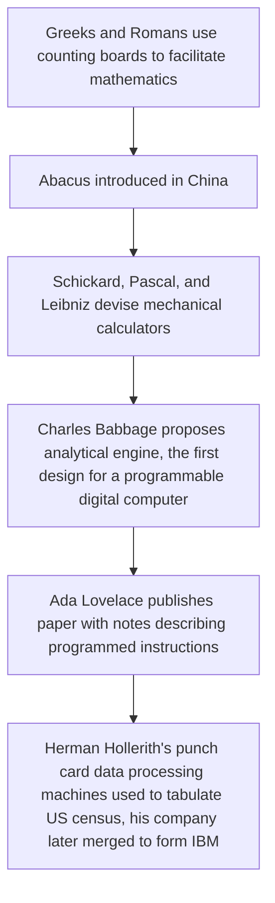

# Chapter 1: Introduction

## 1.1 What is Computer Architecture?
Computer Architecture is the design of computer systems, including all of their major subsystems: the central processing unit (CPU), the memory system, and the input/output (I/O) system. 

CPU design starts with the design of the instruction set that the processor will execute and includes:
* the design of the arithmetic and logic hardware that performs computations
* the register set that holds operands for computations
* the control unit that carries out the execution of instructions (using the other components to do the work)
* internal buses, or connections, that allow these components to communicate with each other

Memory system design uses a variety of components with differing characteristics to form an overall system (including main, or primary, memory and secondary memory) that:
* is affordable 
* has sufficient storage capacity for the intended application
* is fast enough to keep up with the CPU's demand for instructions and data

I/O system design is concerned with getting programs and data into the memory (and ultimately the CPU) and communicating the computational results to the user (or another computing system) as quickly and efficiently as possible.

All subsystems must be well matched and well suited to the intended application in order for the overall system to perform well.

### 1.1.1 Architecture vs. Implementation
Architecture is the design of a computer system. Implementation is a working computer system. Architecutrual vision affects the type of technologies chosen for implementation, and new implementation technologies can broaden the scope of design.

## 1.2 A Brief History of Computer Systems

Babbage's design was based on the decimal (base 10) system. Some of his contemporaries, such as George Boole and Augustus DeMorgan, were developing a system of logical algebra (known today as Boolean algebra) that provided the theoretical underpinnings for modern computers that used a two-valued, or binary, system for representing logical states and numbers. Boolean algebra remained an intellectual curiosity until Claude Shannon recognized (in his 1937 master's thesis at MIT) that it could be used in designing telephone switching networks and, later, computing machines. Boolean algrebra is the logical basis for virtually all modern digital computer design.

Another type of computer predated modern digital computers, "analog computers". They were used to solve certain types of problems that could be expressed as systems of differential equations with time as the independent variable. Analog computers are more properly called analog simulators. They do not perform discrete computations on numbers, but rather operations such as addition, subtraction, integration, and differentiation of analog signals, usually represented by electrical voltages. Analog simulators are continuous rather than discrete, and they operate on real values; numbers are measured rather than counted.

The rest of discussion of the history of computing devices here will be restricted to the electronic digital computing devices of the 20th and 21st centuries.

### 1.2.1 The First Generation (late 1930s to early 1950s)
These computer systems were one-of-a-kind machines, each custom built for a particular purpose. Computers of the early 1940s, such as the **Mark-I** (also known as the IBM Automatic Sequence Controlled Calculator or ASCC) and **Mark-II** built by Howard Aiken at Harvard University, were typically built using electromagnetic relays as the switching elements. This made them very slow.

Later machines were built using vacuum tubes for switching; these were somewhat faster but not reliable. (Tubes have a habit of burning out after a few hundred to thousand hours of use.) Two of the first electronic computers built using vacuum tube technology were the **Atanasoff-Berry Computer** (ABC) developed at Iowa State University and the Electronic Numerical Integrator and Calculator(**ENIAC**) built by John Mauchly and J. Presper Eckert at the University of Pennsylvania for the U.S. Army Ordnance Department's Ballistic Research Laboratories. ENIAC, which was used to calculate bomb trajectories and later to help develop the hydrogen bomb, was more similar to modern pocket calculators than to our general-purpose computers as it was not a stored-program machine. Connections had to be rewired by hand in order to program different calculations.

The first modern computer to run software (program instructions stored in memory that can be modified to make the machine perform different tasks) was the Electronic Discrete Variable Computer (**EDVAC**) designed by Mauchly, Eckert, and John von Neumann of Princeton University. EDVAC was designed to perform sequential processing of instructions that were stored in memory along with the data, characteristics of what has become known as the **von Neumann architecture**. The stored-program concept was a major step forward in computer design, making general-purpose machines feasible. To this day, most computers are still basically von Neumann machines with some enhancements.

Although the original EDVAC design was never built (it was eventually modified and built as Princeton's Institute for Advanced Studies [IAS] Machine), its concepts were used in many other machines. Maurice Wilkes, who worked on the EDVAC, built the Electronic Delay Storage Automatic Calculator (**EDSAC**), which became the first operational stored-program computer using the von Neumann architecture. 

In 1951, the first commercially available computer was produced by the Remington-Rand Corporation; based on the stored-program designs of the EDVAC and EDSAC, this computer was known as **UNIVAC I** (Universal Automatic Computer). The first of 46 of these machines was delivered to the U.S. Census Bureau in 1951. The following year, another UNIVAC was used to predict the outcome fo the Eisenhower-Stevenson presidential race.

### 1.2.2 The Second Generation (mid-1950s to early 1960s)
This generation included the first machines to make use of the new solid-state transistor technology. The transistor, invented in 1947 by John Bardeen, Walter Brattain, and William Shockley of Bell Laboratories, was a major improvement over vacuum tubes in terms of size, power consumption, and reliability. This new implementation technology paved the way for many architectural enhancements, mainly by allowing the total number of switching elements in machines to increase.

Vacuum tube-based computers could never have more than a few thousand switching elements because they were constantly malfunctioning due to tube failures. the mean time between failures (**MTBF**), or average lifetime, of vacuum tubes was only about 5000 hours; a system containing 5000 tubes could thus be expected to have a hardware related crash about once per hour on average. If the machine were to run long enough to do any meaningful calculations, it could only contain a limited number of tubes and (because all logic required switching elements) a very limited set of features.

Even the earliest transistors had a typical MTBF of hundreds of thousands to millions of hours. They were also much smaller and generated less heat, allowing components to be more densely packaged. The result of these factors was that second generation computers could be more complex and have more features than their predecessors without being as large, expensive, or power-hungry, without breaking down as often. Some architectural features that appeared in the second generation include:
* hardware representation of floating-point numbers (introduced on the IBM 704 in 1954)
* hardware interrupts (used in the Univac 1103 in 1954)
* general-purpose registers used for arithmetic or addressing (used in the Ferranti Pegasus in 1956)
* virtual memory (introduced on the University of Manchester's Atlas machine in 1959)
* asynchronous I/O controlled by independent parallel processors, indirect addressing, and hardware interrupts (introduced on the IBM 709 in 1958)

Another technology that came into use with the second generation of computer systems was *magnetic core memory*. Core memory stored binary information as the magnetized states of thousands of tiny, donut shaped ferrite rings or "cores". This technology reduced the space and power required for large amounts of storage. Typical first generation computers had only 1 to 4 kilobytes (KB) of main memory in the form of delay lines, vacuum tubes, or other primitive storage technologies, second generations could have comparatively huge main memories of, for example, 16 KB up to 1 megabyte (MB) of core. This increase in the size of main memory affected the types of instructions provided, the addressing modes used to access memory, etc.

Second generation machines were still bulky and expensive, often taking up an entire large room and costing millions of dollars. The relatively small IBM 650 weighed about a ton (not counting its 3000lb power supply) and cost \$500,000
in 1954. Core memory cost on the order of a dollar per byte. 

During this time came the advent of the first batch-processing and multiprogramming operating systems.

| | | 
| -- | -- |
| Batch-processing | programs were loaded and executed automatically by the system instead of the operator loading them manually | 
| Multiprogramming | more than one program was resident in memory at the same time (made possible by the larger main memory space) |

By keeping multiple programs ready to run and by allowing the system to switch between them automatically, the expensive CPU could be kept busy instead of being idle, awaiting human intervention. Programs were still executed one at a time, but when one program was completed or encountered an I/O operation that would take some time to complete, another program would start. 

The first attempts to make human programmers more productive also occurred during this time. Assembly language, as a shorthand or mneumonic form of machine language, was first developed in the early 1950s. The first high level languages came along a few years later:
$^1$
* Formula Translation (**Fortran**)
* Algorithmic Language (**Algol**)
* Common Business-Oriented Language (**COBOL**)

### 1.2.3 The Third Generation (mid-1960s to early 1970s)
The first usage of *integrated circuits* in computers replaced discrete (individually packaged) transistors. Integrated circuits (ICs) are semicondutor chips containing multiple transistors, starting with one or two dozen transistors comprising a few gates or flip-flops (small scale integration [SSI]) and later increasing to a few hundred tranistors (medium scale integration [MSI]), which allowed an entire reggister, adder, or even an arithmetic logic unit (ALU) or small memory to be fabricated in one package. Core memory was still common, but by the 1970s, core was beginning to be replaced by cheaper, faster semiconductor IC memories. Even machines that used magnetic core for main storage often had a semicondutor *cache memory* to help improve performance.

Integrated circuits continued the trend of computers becoming smaller, faster, and cheaper. All first and second generation machines were what would come to be called *mainframe* computers. The third generation saw the development of the first *minicomputers*, led by Digital Equipment Corporation's (DEC) **PDP-8**, which was introduced in 1964 and cost \$16,000. 

DEC followed it with the more powerful PDP-11 in 1970. Data General brought the Nova minicomputer to market in 1969 and sold 50,000 machines at \$8,000 each.

The availability of these small and relatively inexpensive machines meant that rather than an organization having a single central computer shard among a large number of users, small departments or even individual workers could have their own machines - creating the concept of a *workstation* computer.

The third generation also saw the first of what came to be called *supercomputers* designed. Control Data Corporation introduced the **CDC 6600**, widely considered to be the first supercomputer, in 1964. Seymour Cray was a key contributor to the machine, and later left to form his own compoany. The 6600 was the fastest computer in the world at the time, roughly 3x the speed of the IBM Stretch machine. The main processor operated at 10 MHz clock frequency and was supported by 10 parallel execution units. It could execute 3 million instructions per second and cost about \$7 million.

In 1968, the **CDC 7600** succeeded the 6600, and topped out at 15 million instructions per second. The 7600 had a heavily pipelined architecture and is considered the first *vector processor* (Cray would go on to design many more). Other third generation vector computers included the CDC Star-100 and Texas Instruments' Advanced Scientific Computer (TI-ASC), both announced in 1972. The third generation also saw the development of some of the first high-performance parallel processing machines, including Westinghouse Corporation's SOLOMON prototype and later the ILLIAC IV (a joint venture between the University of Illinois, the US DOD, and Burroughs Corporation). 

The third generation also introdcued the first example of a "family" of computers: the IBM System/360 machines. IBM offered models of the 360 from low-end machines for business applications to high-performance models for the scientific computing market. Although their implementation details, performance characteristics, and price tags varied, all of the IBM 360 models could run the same software. Ever since, it has been common practice for comoputer manufacturers to offer entire lines of compatible machines.

Software-related developments during the third generation of computing included:
* the advent of timesharing operating systems (including the first versions of UNIX)
* virtua lmemory became commonly used
* new, more efficient computer languages were developed

Hardware was becoming more complex, and languages were being simplified. Combined Programming Language (CPL), developed circa 1964 at Cambridge University and the University of London was an attempt to streamline ALGOL  by incorporating only its most important features. Ken Thompson of Bell Laboratories introduced **B** in 1970.

### The Fourth Generation (mid-1970s to 1990)
This generation saw the continuing development of large-scale integration (LSI) and vey large-scale integration (VLSI) circuits containing tens or hundreds of thousands (and eventually millions) of transistors. For the first time, an entire CPU could be fabricated on one semiconductor microcircuit. The first *microprocessor* was Intel's 4-bit 4004 processor, in 1971. It was too primitive to be of much use in general purpose machines, but useful 8-, 16- and even 32-bit microprocessors followed within a few ears; soon essentially all computers had a single-chip microprocessor. 

Semiconductor main memories made of VLSI RAM and ROM devices became standard, too. (Although core memory became extinct, its legacy lives on in the term *core dump*, which refers to the contents of the main memory logged for diagnostic purposes when a crash occurs.) As VLSI components became widely used, computers continued to become smaller, faster, cheaper, and more reliable.
$^2$

The Intel 486 CPU, introduced in 1989, was the first million-transistor microprocessor. It featured an on-chip floating-point unit and cache memory, and was in many ways the culmination of fourth generation technology. 

The invention of the microprocessor led to what was probably the most important development of the fourth generation: the *microcomputer*. The advent of microcomputers meant that almost anyone could have a computer. The first microcomputers were produced in the mid to late 1970s and were based on 8-bit microprocessors. The Altair computer kit, introduced in 1975, was based on the Intel 8080 microprocessor.
$^3$
Steve Wozniak and Steve Jobs developed the Apple I in Wozniak's garage using a Mostek 6502 as the CPU. The refined the design and created the Apple II in 1977, which outsold its competitors (the 6502-based Commodore Pet and the Radio Shack TRS-80, based on a Zilog Z80 processor)

IBM saw the success of the Apple II and entered the microcomputer market with the IBM Personal Computer (or PC)
. It was a hit, prompting other manufacturers to create compatible PC clones, using Intel's 16-bit 8086 processor. 
$^4$
The availability of compatible machines from competing manufacturers helped bring down the price of hardware and make PCs a mass-market commodity.

While IBM enjoyed the success of the original PC and its successor the PC/AT (based on Intel's faster 80286 CPU), Wozniak and Jobs were devloping new systems around Motorola's 16-/32-bit 68000 family of microprocessors. The Apple Lisa (the first microcomputer with a GUI (graphical user interface)) cost too much (about 
\$10,000
) to gain wide acceptance. Its successor, the Apple Macintosh (1984) incorporated many of Lisa's features at about 1/4 the price and gained a large following. 

Acceptance of microcomputers was greatly increased by the development of office applications software. Electric Pencil, written by Michael Shrayer for the Altair, was the first microcomputer word processing program. It was not a big commercial success, but 1979's WordStar gained widespread acceptance.dBase, the database management package, and VisiCalc, the first microcomputer spreadsheet program (originally developed for the Apple II) also appeared in 1979. In particular, VisiCalc and its successor Lotus1-2-3 (developed for the IBM PC) helped promote the use of microcomputers in business.

Microsoft, which got its start with Altair BASIC, won the contract to develop the PC-DOS (later generically marketed as MS-DOS) operating system and a BASIC interpreter for the IBM PC. Soon Microsoft branched into applications also, launching Microsoft Works (a combined word processor, spreadsheet, graphics, and communication program) in 1987. The Windows OS (operating system) and Microsoft Office (successor to Works) gained massive popularity in the 1990s. 

While microcomputers became smaller, cheaper, and more accessible, super computers were becoming more powerful and widely used. The first new supercomputer of the fourth generation, the **Cray-1**, was introduced in 1976 by Seymour Cray, who had formed Cray Research Inc. The Cray-1 cost about
\$8 
million and could execute more than 80 million floating-point operations per second (MFLOPS). Within a few years, Cray released the X-MP (Cray's first multiprocessor supercomputer) in 1982, the Cray-2 in 1985, and Y-MP in 1988. The eight processor Y-MP had a peak calculation rate of more than 2600 MFLOPS - about 30x the performance of the Cray-1. 

Cray Research's competition in the area of high-end vector machines came mostly from Japanese manufacturers. Some important Japanese supercomputers of the 1980s included:
* Nippon Electric Company (NEC) SX-1 and SX-2 (1983)
* Fujitsu VP-100 and VP-200 (1983) and VP-400 (1986)
* Hitachi S820/80 (1987)

Although the dominant supercomputers of this period were mostly pipelined vector machines, the fourth generation also saw the debut of highly parallel supercomputers. The Massively Parallel Processor (MPP), first proposed in 1977 and delivered in 1983 by the Goodyear Aerospace Corporation to NASA Goddard Space Flight Center was a one-of-a-kind machine constructed from 16,384 1-bit processors. A few years later (1986-1987), Thinking Machines Corporation entered the supercomputer market with its Connection Machine CM-1 and CM-2 systems. These machines contained 65,536 processors each: with more than 70 installations, they were the first commercially successful massively parallel supercomputers.

Although most of the developments fo the fourth generation occurre at the high and low ends of the market, traditional mainframes and minicomputers were still in widespread use. IBM continued to dominate the mainframe computer market, introducing a series of upgrades to its System/370  line of machines to replace the System/360 in 1970. Among IBM's fourth generation mainframes were the:
* 3030 series (1977-1981)
* 3080 series (1980-1984)
* 3090 series (1985-1989)
* 4300 series (1979-1989)
All of these machines saw extensive use in a variety of medium to large business applications. 

The dominant minicomputer of the fourth generation was Digital Equipment Corporation's VAX series, the successor to the popular PDP-11. DEC's VAX 11/780, released in 1977, was the first minicomputer with a 32-bit architecture, allowing large amounts of memory to be addressed at once by the programmer. It was also the first minicomputer to execute one million instructions per second. 
| | | 
| -- | -- | 
| VAX | Virtual Address eXtension |
| VMS | Virtual Memory System (OS) |

To address compatibility concerns, early VAX models incorporated a PDP-11 emulation mode to ease migration. The 11/780 was followed by the 11/750 and 11/730, whcih had close to the same performance but were smaller and cheaper. Higher performance needs were addressed by the dual processor 11/782 and 11/785. Largely due to the success of these computers, by 1982 DEC was the number two computer company in the world, behind only IBM. DEC remained a major force in the market as it continued to expand the VAX line through the 1980s, developing the higher performance 8x00 series machines and the microVAX line of microcomputers that were compatible with DEC's larger and more expensive minicomputers. 

Characteristics of fouth generations machines of all descriptions include:
* direct support for high level languages either in hardware (as in traditional Complex Instruction Set Computer [CISC] architectures)
* using optimizing compilers (characteristic of Reduced Instruction Set Computer [RISC] architectures, which were developed in the fourth generation)
The MIPS and SPARC architectures gave rise to the first RISC microprocessors of the mid-1980s. They quicly rose to challenge, and in many cases, replace dominant CISC microprocessors such as the Motorola 680x0 and Intel x86 CPUs as well as IBM's mainframes and DEC's minicomputers.

With the advent of hardware memory management units, timesharing operating systems and the use of virtual memory (previously available only on mainframes and minicomputers) became standard on microcomputers by the end of the fourth generation. By giving each program the illusion it had exclusive use of the machines, these techniques made programming much simpler. 

Compilers were considerably improved during the 1970s and 1980s, and a number of new programming languages came into use. BASIC, a language simple enough to be interpreted rather than compiled, became popular for use with microcomputers. 

In 1984, Borland's inexpensive Turbo Pascal compiler brought high-level language programming to the personal computer mainstream. Meanwhile, C, developed in 1974 by Dennis Rithcie of Bell Laboratories as a refinement of Ken Thompson's B, became the dominant language for systems programming (especially UNIX). Fortran 77 was widely used for scientific applications, and Ada was adopted by the US military in 1983 for mission-critical applications. 

Finally, object-oriented programming got its start during hte fourth generation. C++ was developed by Bjarn Stroustrup at Bell Laboratories during the early 1980s; the first version of the new OO language was released in 1985. 

### 1.2.5 The Fifth Generation (~1990 to 2005)
The fifth generation can arguably be termed more evolutionary than revolutionary, at least in terms of architectural features. Machines of this era used VLSI and ultra-large-scale integration (ULSI) chips with tens (evenutally hundreds) of millions of transistors to perform many complex functions, such as graphics and multimedia operations in hardware. Processors became more internally parallel (using techniques such as superscalar and superpipelined design to execute more instructions per clock cycle), and parallelism using multiple processors, once found only in mainframes and supercomputers, started becoming more common even in home and small business systems. Processor clock frequencies that reached the tens of megahertz in fourth generation machiens increased to hundreds and thousands of megahertz (1 GHz = 1000 MHz). Intel's Pentium microprocessor, introduced in 1993, had two pipelined execution units and was capable of executing 100 million instructions per second. Ten years later, its successor the Pentium 4, reached clock speeds of 3.2 GHz on a much more highly concurrent internal microarchitecture, implying a microprocessor performance improvement of roughly two orders of magnitude over that time span.

With microprocessors becoming ever more powerful, microcomputers were the big story of computing in the fifth generation. Personal computers and scientific and engineering workstations powered by single or multiple microprocessors, often coupled with large amounts of memory and high-speed, low-cost graphics cards, took over many of the jobs once performed by minicomputers (which effectively became extinct.) and even mainframes such as IBM's zSeries (which were mostly relegated to important but behind the scenes applications in business transaction processing.) Even the supercomputers of this generation increasingly made use of standard microprocessor chips instead of custom-designed, special-purpose processors.

Supercomputing experienced a transformation during the fifth generation. High-speed pipelined vector processors of the late 1970s and 1980s only proved cost-effective in a limited number of applications and started to fall out of favor for all but extremely numerically intensive computatations done by well-funded government agencies. By the 1990s, Fujitsu and other manufacturers quit making vector computers, leaving NEC and Cray as the only vendors of this type of system. Cray Computer Corporation was spun off from Cray Research, Inc., to develop the Cray-3, but only one machine was delivered before the company filed for Chapter 11 bankruptcy in 1995; plans for the Cray-4 were abandoned. 

Cray Research Inc. began to move toward nonvector, massively parallel, microprocessor based systems in the mid-1990s, producing its T3D and T3E machines before being bought by Silicon Graphics, Inc. (SGI) in 1996. SGI's Cray Research Division produced the SV1 vector supercomputer in 1998 but was sold in March 2000 to Tera Computer COmpany and renamed Cray, Inc. Cray, Inc. introduced the X1 (formerly codenamed the SV2) in 2002. Meanwhile in 2001, NEC signed an agreement with Cray, Inc. to market its SX-5 and SX-6 supercomputers, effectively combining all remaining high-end vector machines into a single vendor's product line. 

By June 2005, only 18 of the top 500 supercomputers were vector processors (including 9 Crays and 7 NEC machines). The other 482 were highly parallel scalar machines, mostly built by IBM (259), Hewlett-Packard (131), and SGI (24). An increasing number of high-performance computer systems, including 304 of the June 2005 top 500, were classified as *cluster systems* composed of large numbers of inexpensive microcomputers connected by high-speed communication networks. Many of these clusters ran the open-source Linux operating system, which enjoyed a surge in popularity during the 1990s and early 2000s for all classes of machines from PCs (with which it began to make inroads into popularity of Microsoft's Windows operating system) to supercomputers. 

Perhaps the most important characteristic of fifth generation computer systems, large or small, that distinguished them from systems of previous generations was the pervasiveness of networking. In previous generations, the vast majority of computers were designed as self-contained standalone systems. The Internet was virtually unknown outside of government installations and academia. Networking capabilities, if they existed at all, were separately designed hardware and software additions tacked onto a system not designed with connectivity intended. By the mid-1990s, modems had become fast enough to allow reasonable dial-up connections between PCs (and their GUIs) and the Internet. E-mail clients, such as Eudora, allowed easy electronic communication. GUI browsers, such as Mosaic (and later Netscape and Internet Explorer), let users conveniently surf for hyperlinked information all over the World Wide Web. Users quickly demanded more and better connectivity for low-end systems; ISDN (integrated services digital network) and eventually DSL (digital subscriber line) and cable modem service were developed to meet this demand.

Fifth generation computers and their operating systems were designed from the ground up to be connected to wired and/or wireless local area or wide area networks (LANs and WANs) and the Internet. UNIX, from which Linux was derived, had been network-friendly for many years; Apple and Microsoft followed suit by integrating networking capabilities into their OS. 

Even the programming languages of this era, such as Java (1995) were designed with a networked environment in mind. This focus on connectivity was not confined to traditional computer systems; another characteristic of the fifth generation was the blurring of distinctions between general purpose computers and other communications devices (like PDAs, cell phones, pagers, digital cameras, and media players). Users increasingly expected all of their electronic devices to be able to conveniently exchange information, and especially during the latter part of the fifth generation, this became much easier than ever before.

### 1.2.6 The Sixth Generation (Modern Computing)
Some computing professionals (uncited in textbook) claim that we are still in the fifth or even fourth generation of computing, but a good case can be made (by Dumas, presumably) that we are currently (since ~2005) well into a sixth generation. Computing hardware and the ways systems are connected together and used have changed since the early 2000s. 

In terms of processors, although fifth generation CPU chips could contain tens or hundreds of millions of transistors, it has become common for sixth generation processors to contain billions of transistors. Generally, these additional transistors have been used in two main ways: constructing ever-larger on-chip cache memories and adding additional processing cores (essentially creating single-chip multiprocessor systems). The results have been continued increases in processing power even as clock frequencies have leveled off in the low gigahertz range. 

In 2006, Intel released a dual-core version of its Itanium 2 processor with 1.7 billion transistors, constructed with a feature size of 90 nanometers (nm). In 2010, its sucessor, the quad-core Itanium 9300 (code named Tukwila), built with a 65nm feature size, became the first microprocessor to contain more than 2 billion transistors. Other manufacturers made similar progress:
* IBM released its eight core POWER7 chip (1.2 billion transistors, 45nm, 2010)
* Advanced Micro Devices (AMD) introduced a pair of [name not included in textbook] chips (billion+ transistors, 32nm, 2012)
* Apple released dual-core A8 and tri-core A8X processors (2 billion and 3 billion transistors, 20nm [presumably same with A8X? Not provided in textbook], 2014)
* Oracle (which acquired Sun Microsystems) released SPARC T3 processor (billion+ transistor, 2010) and 32-core SPARC M7 (10 billion transistors, 2015)

As processors increased in transistor count and overall performance, main memory and secondary storage continued to steadily increase in capacity and speed. The same basic main memory technology that was used in most fifth generation computers - Synchronous Dynamic Random Access Memory (SDRAM) - continued to be the dominant form of main memory through the sixth generation. Between 2003 and 2007 (corresponding to the MS XP generation), it was common for such systems to have somewhere in the range of 256 to 1024 megabytes (or 1/4 to 1 gigabyte) of second generation double data rate (DDR2) SDRAM, which could transfer data at a peak speed of 3200 megabytes per second or better, depending on the specific modules used.

Over the next few years RAM sizes gradually increased, such that by 2015 4 gigabytes was typical of a very low end PC, and most small systems came standard with 6-8 gigabytes or more. The introduction of DDR3 SDRAM in 2007 and DDR4 SDRAM in 2014 doubled and redoubled the peak data transfer rates to and from main memory. As far secondary storage was concerned, magnetic hard disk drives continued to dominate the market, although hybrid drives (containing both a hard disk and a smaller amount of nonvolatile semiconductor flash memory) and even completely solid-state drives (SSDs, constructed solely of the more expensive but faster flash memory) increased in popularity over time. At the beginning of the sixth generations, small systems typically had a hard drive capacity of a few to a few dozen gigabytes, and the largest available drives were about 500 GB. 10 years later, 1 terabyte (TB) drives were inexpensive and commonplace, and the most advanced drives offered 10 times that much storage.

The increase in main memory sizes for all sorts of systems from personal computers to servers and mainframes helped bring 64-bit CPUs (and operating systems) to the forefront. Although 64-bit supercomputer architectures debuted during the fourth generation and 64-bit servers began to appear during the fifth, it wasn't until 2003-2004 that first AMD and then Intel produced 64-bit versions of their ubiquitous x86 processors. In April 2005, Microsoft released a 64-bit version of its Windows XP Professional OS, following up in January 2007 with 64-bit Windows Vista. These and subsequent OS would take advantage of the newest processors with their AMD64 and Intel 64 architectures, generically known in the industry as x86-64. While previous PCs and servers running 32-bit operationg systems could only address 
$2^{32}$
bytes (4 gigabytes) of main memory, it henceforth became common for even inexpensive desktop and laptop systems to exceed that amount. Theorteically, 64-bit systmes could address up to 
$2^{64}$
bytes (16 exabytes) of memory space although (as of the writing of the textbook) current implementations only use 48 of the 64 possible address bits for a total available memory space of 256 terabytes.

Although wireless local area network (WLAN) technology was first conceived during the third generation of computing (1971), and the first version of the Institute of Electrical and Electronics Engineers (IEEE) 802.11 standard was released in 1999 during the fifth generation, it was during the sixth generation that wireless digital communication technologies (including WLANs and cellular data transmission networks) became widely used. With the advent of third-generation (3G) cellular networks in the early 2000s and fourth-generation (4G) networks a few years later, in addition to the widespread availability of Wi-Fi WLAN "hotspots" or access points and the proliferation of touch-screen technology, an entirely new class of mobile computing systems, including tablet computers and smartphones, was born. At last, both computing power and digital communications capability could travel with any user. 

Smartphones essentially replaced cell phones and PDAs. BlackBerry's first smartphone was released in 2003. Apple's first iPhone was introduced in 2007, and the following year marked the debut of the HTC Dream - the first smartphone to use the Android mobile operating system. Not only could these devices access the internet, act as GPS (global positioning system) trackers, perform voice recognition or other AI functions, and make calls, their ability to run custom application programs (apps) allowed almost limitless extensions to their functionality. Given the proliferation of ever more sophisticated apps, users demanded greater computing power. The first 64-bit Advanced RISC Machine (ARM) processor (the architecture used in most mobile computing devices) was announced in 2011. In 2013, Apple's iPhone 5S became the first 64-bit smartphone; the first 64-bit Android devices debuted the following year.

The concept of *cloud computing* became widely known and used in a variety of ways. While defined in many different ways, one common thread is that cloud-based approaches take advantage of wired and/or wireless data communication between local and remote computing systems. The precise location and nature of the system(s) providing cloud services, which could be computational, data storage, or both, is generally unknown and of no particular concern to the end user. Another common technique used in cloud computing is virtualization, where the resources as seen and accessed by a user may - but usually do not - correspond to a specific physical system. For example, a user may log into what appears to be a dedicated Windows or Linux server, but that capability may be only one of many services running on a remote machine that may be natively running a completely different OS. By utilizing cloud based resources, rather than local computing hardware, users can gain benefits including reliability, scalability, and access to services from almost anywhere using a variety of devices.

High-end systems also made great strides in the sixth generation. One of the most important techniques during this time span was the use of Graphics Processing Units (GPUs) to supplement conventional CPUs in handling certain demanding computing jobs. GPUs are specialized processors optimized for the mathematically intensive process of creating images - often in the context of a game, simulation, or virtual environment. Specialized graphics hardware has been in existence since at least the fourth generation, and the term GPU was coined during the fifth generation (1999) by NVIDIA Corporation, which described its GeForce 256 processor as the "world's first GPU". However, it was several years later before the practice of using GPUs for nongraphical tasks (General-Purpose computing on Graphics Processing Units [GPGPU]) was widely adopted. The same type of hardware parallelism that makes GPUs good at processing image data has also been found to be extremely efficient for processing other types of data, particularly performing scientific computations on highly parallel data sets composed of vectors or matrices. The development of proprietary progamming languages, such as NVIDIA's Compute Unified Device Architecture (CUDA), and cross-platform languages, such as OpenCL, have allowed programmers to apply the power of GPUs to many computationally intensive problems. By November 2015, the fraction of the world's top 500 supercomputers that used GPU coprocessors/accelerators to boost their computational performance had risen to 21% (104/500).

Another concept that came to the forefront this generation was *big data analytics*. The combined availability of large, inexpensive hard disk drives and fast, inexpensive networking technology enabled the construction of huge data storage repositories, which may take the form of:
* direct-attached storage (DAS)
* network-attached storage (NAS)
* storage area networks (SANs)

These huge structures allowed for storage of tens or hundreds of terabytes (even petabytes) of data, big data sets, often poorly structured or unstructured and therefore beyond the ability of traditional relational databases and software data analysis tools to handle. These sets have been and are being generated constantly from a variety of sources, such as:
* point of sale systems
* web server logs
* social media sites
* sensor networks
* mobile devices

The point of collecting such vast data sets is to analyze them for useful information or insights. A grocery store custom-selects coupons to print for individual shoppers, a politician's campaign team analyzes voting patterns, financial analysts predict stock market trends, government agencies attempt to detect terrorist activity, etc. To enable timely and useful analysis of big data, new tools that leverage distributed processing power and storage have had to be developed. As of the textbook's writing, one of the most popular platforms for big data analytics was *Hadoop*, the Apache Software Foundation's Java-based, open-source software framework for distributed data processing. Tools based on this and other technologies will continue to evolve as the data sets grow in size and complexity. 

## 1.3 Types of Computer Systems
The first large computers, descendants of which are still used in demanding applications, are referred to as *mainframe* computers. The somewhat less powerful (and cheaper) machines, smaller than mainframes were known as *minicomputers*. (As previously mentioned, they are now essentially extinct.) *Microcomputer* is a very general classification, literally referring to any machine using a microprocessor (or single-chip CPU) as its main processor. As this is true of virtually all computers of the 21st century, the term has largely lost ability to distinguish different classes of systems.

Common types of modern microcomputer systems include: 
| | |
| -- | -- |
| *personal computers* | desktop and portable machines like laptops, notebooks, and netbooks |
| *workstations* | machines that include high-performance CPUs and GPUs to support applications such as CAD and data visualization |
| *mobile computers* | tablets, smartphones, smartwatches, etc. |
| *microcontrollers* | embedded in other products such as appliances, consumer electronics, vehicles, etc. |
| *game consoles* | specialized machines designed to interact in real time with users and provide realistic virtual environments for gameplay |
| *digital signal processors* (DSPs) | used to process digitized audio, video, and other analog information |
| *supercomputers* | used to perform intensive operations need to solve large-scale scientific and engineering problems | 

It is sometimes useful to classify systems by underlying architectural design instead of size, speed, or application. The most fundamental distinction is between systems that have only once CPU and those that use multiple (parallel) processors. Individual CPUs may be described as having a Princeton or Harvard architecture; parallel systems may be classified in several ways depending on the number and nature of the processing units, and the means used to connect them. Some experimental or special-purpose systems defy attempts at classification.

### 1.3.1 Single Processor Systems (Princeton Architecture)
The original digital computer systems ran programs on a single CPU. This is still true of many systems today. Though man enhancements have been made over the years, almost every processor available today is descended from the original von Neumann architecture develped for the EDVAC and EDSAC in the 1940s. Also known as the Princeton architecture (because John von Neumann was a researcher ath their Institute for Advanced Studies), the von Neumann architecture was the first mdoern design for a computer based on the stored program concept originally developed by Babbage. The block diagram of the von Neumann computer:

clearly shows i/o devices as well as the single memory used to store both data and program instructions. The control unit and arithmetic/logic unit (ALU) of the von Neumann machine are key parts of the CPU in modern microprocessors (internal registers were added later to provide faster storage for a limited amount of data).

The goal of the orginal von Neumann machine was to numerically solve scientific and engineering problems involving differential equations, but it has proven adaptable to many other classes of problems. It is so versatile that the vast majority of modern computer systems are quite similar, though much faster. The main factor distinguishing this architecture from previous machines (and its primary reason for success and adoption as dominant computing paradigm) was the stored program concept. Because the machine receives its instructions from an easily modified progragram in memory rather than hard wiring, the same hardware can perform a wide variety of tasks. 

The von Neumann machine cycle: 

is the process that must be carried out for each instruction in a stored computer program. When all the steps are complete for a given instruction, the CPU is ready to process the next instruction. 

| step | process |
| -- | -- |
| Fetch instruction | read from memory |
| Decode instruction | hardware inside CPU interprets the bits and determines what operation needs to be done |
| Generate address of operand(s) | determine location of operands |
| Fetch operand(s) | fetched from registers, memory locations, or an input device and sent to the ALU |
| Perform operation | ALU performs operation |
| Store results | results are stored in specified location or sent to output device |

The *Harvard architecture* is an alternative computer organization devloped by Howard Aiken at Harvard University and used in the Mark-I and Mark-II machines. It aims to avoid the "von Neumann bottleneck" (the single path to memory for acessing both instructions and data) by providing separate memories and buses (access paths) for instructions and data:

Thus, instructions may be fetched while data is being read or written. This is one of many examples in which an increase in implementation cost and complexity may be justified in order to obtain a corresponding increase in performance. 

Many modern systems use this type of structure, though it is very rare to see a true Harvard machine (with completely separate memories for code and data). It is common to emply a *modified Harvard architecture* in which main memory is unified (contains code and data), but separate *cache* memories are provided for code and data. This mdoel can achieve virtually the same performance advantage as the original Harvard architecture, but with a simplified overal design and operation of the system. (When programs themselves must be manipulated as data, the task would be more cumbersome with completely separate memories.)

# Footnotes
$^1$
John von Neumann opposed the development of assemblers and high-level language compilers. He preferred to employ legions of human programmers to hand-assemble code into machine language. "It is a waste of a valuable scientific computing instrument to use it to do clerical work."

$^2$
The more components that are fabricated onto a single chip, the fewer chips that must be used and the less wiring is required. External wiring is more expensive and more easily broken than on-chip connections and tends to reduce speeds. 

$^3$
Bill Gates and Paul Allen of Microsoft got their start by devloping a BASIC interpreter for the Altair.

$^4$
The IBM PC and PC/XT actually used the cheaper 8088 chip, which was architecturally identical to the 8086, but had an 8-bit external interface.

# Sources
* [Computer Architecture: Fundamentals and Principles of Computer Design, 2nd ed.](https://www.amazon.com/Computer-Architecture-Fundamentals-Principles-Design/dp/1498772714) by Joseph Dumas
