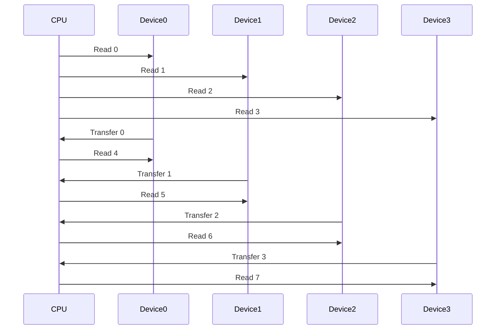

# Chapter 2: Computer Memory Systems
## 2.1 The Memory Hierarchy
Memory in modern computer systems is a collection of many different devices with different physical characteristics and modes of operation, because no mory device possesses all the characteristics we consider ideal. By combining multiple types of memory devices in one system, we hope to obtain the advantages of each while minimizing their disadvantages. 
### 2.1.1 Characteristics of an Ideal Memory

| Desired Attribute | Description |
| ----------------- | ----------- |
| Low cost | Ideally memory would be as inexpensive as possible so that we can afford all we need. In order to make a fair cost comparison, we generally refer to the price of memory per amount of storage. (Ex. dollars per gigabyte) |
| High speed | Every type of memory has an associated *access time* (time to read or write a single piece of information) and *cycle time* (the time between repetitive reads or writes; sometimes, due to overhead or device recovery time, the cycle time is longer than access time). The shorter the access and cycle times, the faster the device. Practically, in order to keep our CPU busy rather than waiting, we need to be able to access information in memory in the same or less time that it takes to perform a computation. Thus, while the current computation is being performed, we can store a previous result and obtain the operand for the next computation. | 
| High density | High *information density* means we are able to store a great deal of information in a small physical space. We might refer to the number of gigabytes or terabytes that can be stored in a given area of circuit board space, or more appropriately, in a given volume (cubic inches or cubic centimeters). | 
| Nonvolatile | Many memory technologies are *volatile*; they require continuous application of power in order to retain their contents. Some types of memory, like the DRAM used as main memory in most systems, require not only continuous power but periodic refresh of stored information. Such a memory is volatile in more ways than one. Nonvolatile memory is ideal, as it maintains its stored information indefinitely in the absence of power and outside intervention. |
| Read/write capable |  Memory devices that allow the user to readily store and retrieve information are called *read/write memories* (RWMs). The less desirable alternative is a memory with fixed contents that can only be read; such a device is called a *read-only memory* (ROM). Of course, a write-only memory that allwed storage but not retrieval wouldn't make much sense. There are also some memory technologies that allow writes to occur, but in a way that is more costly (in terms of time, overhead, device life, or some other factor) than reads. We might refer to such a device, like flash memory, as a "read-mostly memory". A RWM is usually preferred over other types. |
| Low power | Volatile memory devices require continuous application of power. Even nonvolatile memories, which can maintain their contents without power, require power for information to be read or written. Sometimes this is a relatively minor consideration; in other applications, such as when heating is a problem or a system must ron off batteries, it is critical that our memory system consume as little power as possible. Memory that consumes less power is always better. |
| Durability | Ideally our memory system would last forever, or at least until the rest of the system is obsolete and we are ready to retire it. Based on historical data and knowledge of their manufacturing processes, memory device manufacturers may provide an estimate of the mean time between failures (MBTF) of their products. This is the average time a given part is supposed to last. (The life of any individual device may vary quite a bit from the average.) They may also express the expected lifetime of a product in other ways, such as in terms of the total number of read or write functions it should be able to perform before failing. (For this to be useful, one must estimate how frequently the device will be accessed during normal operations.) Durability may also be interpreted in terms of a device's ability to survive various forms of abuse: impact, temperature and humidity extremes, etc. In general, memory technologies that do not use moving mechanical parts tend to last longer and survive more mistreatment than those that do. |
| Removable | In many instances, it is advantageous to be able to transport memory (and preferably its contents) from one computer system to another. This facilitates sharing and backing up information. In rare situations when physical security of information is important (like government or trade secrets), being able to remove memory may be considered undesirable. In most cases it is a desirable feature, and in some cases essential. |

The goal is to create a memory system that is fast, has high storage capacity, is readable and writable, maintains its contents under as many scenarios as possible, and yet is as inexpensive and convenient to use as possible.

### 2.1.2 Characteristics of Real Memory Devices
The most popular types of memory are semiconductor chips (integrated circuits) and magnetic and optical media. There are several subtypes using each of these technologies, and each of these has some advantages. 

*Semiconductor memories* in general possess the advantage of speed. This is why the main memory space of virtually all modern computers is populated exclusively with semiconductor devices, and magnetic and optical devices are relegated to the role of secondary or tertiary (backup) storage. The CPU is built using semiconductor technology, and only a similar memory technology can keep up with processor speeds. In fact, not all semiconductor memories can operate at the full speed of most modern CPUs. As such, the vast majority of semiconductor main memory systems have an associated cache memory made up of the very fastest memory devices.

The semiconductor memory technology with the highest information density is *dynamic random access memory* (DRAM). Due to that, because it is read/write memory, and because it has a relatively low cost per gigabyte, DRAM is used for the bulk of main memory in most computer systems. A DRAM device consists of a large array of capacitors (electrical devices capable of storing a charge). A charged capacitor is interpreted as storing a binary 1, and an uncharged capacitor indicates binary 0. Unfortunately, the capacitors in a DRAM device will discharge, or leak, over time; thus, to be able to continue to distinguish 1s from 0s and avoid losing stored informatoin, the information must periodially be read and then rewritten. This process is called dynamic RAM *refresh*. It adds to the complexity of the memory control circuitry, but in general this is a worthwile trade-off due to the low cost and high storage density of DRAM.

Given the desired main memory size in most systems, compared to the amount of DRAM that can be fabricated on a single integrated circuit (IC), DRAM is not usually sold as individual chips. Rather, several ICs are packaged together on a small printed circuit board module that plugs into the system board, or motherboard. These modules come in various forms, the most popular of which are known as *dual inline memory modules* (DIMMs) and *small outline dual inline memory modules* (SODIMMs). Some of these modules are faster (lower access times and/or higher synchronous clock frequencies) than others, and different types plug into different size sockets (thus it is important to buy the correct type), but they all use DRAM devices as the basic storage medium. 

Although dynamic RAM offers relatively low cost and high density storage, in general it is not capable of keeping up with the full speed of modern micropricessors. Capacitors can be made very small and are easy to fabricate on silicon, but they take time to charge and discharge; this affects the access time for the device. The highest-speed semiconductor read/write memory technology is referred to as *static random access memory* (SRAM). In an SRAM, the binary information is stored as the states of latches or flip-flops rather than capacitors. (In other words, SRAM is built similarly to the storage registers inside a CPU.) SRAM is less dense than DRAM (it takes more space to build a static RAM cell than a capacitor) and therefore more expensive per amount of storage. SRAM, like DRAM, is a volatile technology that requires continous application of electrical power to maintain its contents. However, because the bits are statically stored in latches, SRAM does not require periodic refresh. Contents are maintained indefinitely as long as power is applied. Compared to DRAM, SRAM circuitry requires more power for read/write oepration, but some SRAMs (like the Complementary Metal Oxide Semiconductor (CMOS) static RAM devices sometimes used to retain system settings) require very little current in standby mode and thus can maintain stored information for years under battery power. 

Semiconductor read-only memories (ROMs), including *programmable read-only memories* (PROMs) and *erasable/programmable read-only memories* (EPROMs), are roughly comparable to SRAM in cost and density though they generally operate at DRAM speeds or slower. They are nonvolatile but have the major limitation of not being writable (EPROMs can be reprogrammed in a separate circuit after erasure with ultraviolet light). As such, ROMs are only useful in limited applications, such as single-purpose embedded systems, video game cartridges (or disks), and the basic input/output system (BIOS) that contains the bootstrap code and low-level input/output I/O routines for most typical computer systems.

Semiconductor "read-mostly" memories include *electrically erasable programmable read-only memories* (EEPROMs)and their technological descendants, *flash memories*. These memories are nonvolatile, but (unlike ROMs) they are rewritable in-circuit. Writes, however, can take significanlty longer than reads to perform and in some cases must be done as 'block' writes rather than individual memory locations. Also, these devices are more expensive than most other semiconductor memories and can only be rewritten a limited number (usually a few tens or hundreds of thousands) of times, so they are not suitable for populating the entire main memory space of a computer. Instead, read-mostly memories are typically used for special purpose applications, such as digital cameras, portable thumb drives, hybrid drives, tablets, and smartphones.

*Magnetic memories* have been in use much longer than semiconductor memories, almost as long as there have been electronic computers. Mainframe computers of the 1950s often used rotating magnetic drums for storage. A few years later, magnetic *core memory* became the standard technology for main memory and remained so until it was replaced by integrated circuit RAM and ROM in the 1970s. Magnetic core memory, like all magnetic memories, offered the advantage of nonvolatility (except in the presence of a strong external magnetic field). Access times were on the order of microseconds, so this technology fell out of favor when faster semiconductor memories became cost-competitive. Another related (but slower) technology, *magnetic bubble memory*, was once thought ideal for long-term storage applications but could not compete with inexpensive disk drives, battery-backed SRAMs, and EEPROMs; it eventually died out. Ferroelectric RAM (FeRAM), another descendant of core memory, is still in production but has never caught on widely due to its much lower information storage density as compared with DRAM and flash memory. 

Magnetic storage in most modern computers is in the form of disk and tape drives. Access times for magnetic disks are on the order of milliseconds or longer, so this technology is useful only for secondary storage, not main memory. Tape drives are even slower due to the frequent necessity of traversing a long physical distance down the tape to access requested information. The chief advantages of magnetic memories, besides nonvolatility, are very low cost per gigabyte of storage and extremely high information density (a hard drive can store a terabyte or more of data in a few cubic inches of space). Removable disks and tape cartridges (and some hard drives) also offer the advantage of portability.

Although magnetic memories are currently relegated to secondary storage applications, *magnetic RAM* (MRAM) is a developing memory technology that has the potential to eventually replace DRAM in main memory applications. MRAM operates on the principle of magnetoresistance, where an electric current is ued to change the magnetic properties of a solid-state material. Pieces of this material are sandwiched between two perpendicular layers of wires. A bit is stored at each point where one wire crosses over another. To write a bit, a current is passed through the wires; changing the polarity of the magnet changes the electrical resistance of the sandwiched material. Reading a bit is accomplished by passing a current through wires connected to a sandwich and detecting its resistance; a high resistance is interpreted as binary 1 and a low resistance as binary 0.

Because the bits are stored as magnetic fields rather than electrical charge, MRAM (like other magnetic memories) is nonvolatile. If it can achieve denisty, speed, and cost comparable to DRAM, MRAM will enable the devopment of "instant-on" computers that retain the operating system, applications, and data in main memory even when the system is turned off.[^1]

[^1]: Several companies, including IBM, Honeywell, Everspin, and Cypress Semiconductor, have produced MRAM devices in limited quantities. However, perhaps due to continued high demand for DRAM and flash memory, manufacturers have been hesitant to commit resources (money and fabrication plants) to high-volume production of MRAM chips. If and when they are mass produced, MRAM devices could largely replace DRAM in computer main memory applications within a few years.

*Optical memories* are becoming more and more common, all the way down to low-end computers. Even inexpensive personal computers often have an optical drive that can at least read and often write various tpes of optical discs including *compact disk* CDs, *digital versatile disks* DVDs, and/or *Blu-ray disks* BDs. Depneding on type, an optical disk can store anywhere from several hundred megabytes of data (CD) to as much as 50 GB (BD) at a typical price of less than \$1 
each. In addition to their low cost, optical disks offer most of the same advantages (portability, nonvolatility, and high density) of magnetic disks and also are immune to erasure by magnetic fields. They are much too slow to be used for main memory, however, and the writing process takes considerably longer than writing to a magnetic disk. Their most common uses are for distribution of software and digitally recorded media, and as an inexpensive backup/archival data storage.

### 2.1.3 Hierarchical Memory Systems
It makes sense to use a mixture of different types of devices in a system in order to try to trade off the advantages and disadvantages of each memory technology. We try to design the system to maximize the particular advantages of each type of memory while minimizing, or at least covering up, their disadvantages. In this way, the overall memory system can approximate our ideal system: large in capacity, dense, fast, read/write capable, and inexpensive, with at least some parts being removable and the critical parts being nonvolatile. The typical solution is a computer system design on which a hierarchy of memory subsystems is made up of several types of devices, as depicted below, first conceptually, then within the example of typical modern computers:

Note that the upper levels of the hierarchy are the fastest but the smallest in terms of storage capacity. This is often due at least somewhat to space limitations, but it is mainly because the fastest memory technologies, like SRAM, are the most expensive. 

Because the higher levels of the memory hierarchy have smaller capacities, it is impossible to keep all the information (program code and data) we need in these levels at one time. In practice, each higher level of the hierarchy contains only a subset of the information from the levels below it. The fundamental idea underlying the hierarchical memory concept is that we want to make as many accesses (as a percentage of total) as we can to the upper levels of the hierarchy while only rarely having to access the lower levels. Thus, the resulting overall memory system approaches the speed of the highest levels while maintaining a capacity and cost per gigabyte approximating that of the lowest levels. 

Optimizing the performance of memory systems has always been a big problem due to technological and cost limitations. For the vast majority of tasks, computer systems tend to require much more code and data storage than computational hardware. Thus, it is generally not cost-effective to build the memory system using the same technology as the processor. Over the history of computers, CPUs have increased in speed (or decreased their clock cycle times) more rapidly than memory devices. There has always been a performance gap between the CPU and main memory (and a much bigger gap between CPU and secondary memory), and these gaps have increased with time. Design techniques that effectively close the gap are more important now than ever. The question has been: 'How do we fix things so the memory system can keep up with the processor's demand for instructions and data?' The rest of this chapter examines several techniques to that end.

## 2.2 Main Memory Interleaving
We previously mentioned that the storage capacity of individual memory chips is such that a number of devices must be used together to achieve the desired total main memory size. This is unfortunate from a packaging and parts count standpoint, but has some advantages in terms of fault tolerance and flexibility of organization. Constructing main memory from several smaller devices or sets of devices allows the designer to choose how the addressed locations are distributed among the devices. This distribution of memory addresses over a number of physically separate storage locations is referred to as *interleaving*. Given a particular pattern of memory references, the type of interleaving used can affect performance.

### 2.2.1 High-order Interleaving
This is the simplest and most common way to organize a computer's main memory when constructing it from a number of smaller devices. A simple example would be the design of a 64 KB memory using four
$18\mathrm{K} \times 8 \ \mathrm{RAM}$
devices:

A memory with 
$64\mathrm{K}$
 (actually 
$65,536$
 or 
$2^{16}$
) addressable locations requires 
$16$
 binary address lines to uniquely identify a given location. In this example, each individual device contains
$2^{14} = 16,384$
locations and thus has 
$14$
 address lines. The low-order
 $14$
 address bits from the CPU are connected to all four devices in common, and the high-order two address bits are connected to an address decoder to generate the four chip select (CS) inputs. Because the decoder outputs are mutually exclusinve, only one of the four memory devices will be enabled at a time. This device will respond to its address inputs and the read/write control signal by performing the desired operation on one of its
 $2^{14}$
 byte-wide storage locatoins. The data to be read or written will be transferred via the data bus.

 The operation of the memory system would not be materially altered if smaller devices were used. If 'narrower' devices (say, 
 $16\mathrm{K} \times 8$
 or 
 $16\mathrm{K} \times 1$
 ) were available, we would simply replace each
 $16\mathrm{K} \times 8$
 device with a bank of multiple devices, and each smaller device would be connected to a subset of the data bus lines. If we were to use 'shallower' devices, such as 
 $8\mathrm{K} \times 8$
 memory chips, each chip would require fewer of the low-order address lines (in this case 13 instead of 14) and we would need a larger address decoder (3 to 8 instead of 2 to 4) to generate the additional chip selects from the high-order address lines. The basic theory of operation would be the same.

 The distribution of memory addresses over the several devices (or banks of devices) in this high-order interleaved system is such that the consecutively numbered memory locations are in the same device, except when crossing a
 $16\mathrm{K}$
 boundary. In other words, device
 $0$
 contains memory locations
 $0$
 through 
 $16,383$
(
$0000000000000000$
through
$0011111111111111$
binary, or
$0000$
through
$3\mathrm{FFF}$
hexadecimal). Device
$1$
contains locations
$16,384$
through 
$32,767$
, device 
$2$
contains locations
$32,768$
through
$49,151$
, and device 
$3$
contains locations
$49,152$
through
$65,535$
.

This high-order interleaved memory organization is simple, easy to understand, requires few external parts (just one decoder), and offers the advantage that if one of the devices fails, the others can remain operational and provide a large amount of contiguously addressed memory. In our example, if device 
$0$
or 
$3$
fails, we would still have 
$48 \mathrm{KB}$
of contiguous memory space, and if device 
$1$
or 
$2$
fails, we would have one working
$32 \mathrm{KB}$
block of memory and one
$16 \mathrm{KB}$
block. It also has the beneficial side-effect that if the memory system is to be dual- or multiported (accessible from more than one bus, as in a system with multiple processors) and if the necessary hardware is added to support this, then much of the time access may occur to separate banks simultaneously, thus multiplying the effective memory bandwidth. 

The disadvantage of high-order interleaving (when used with a single data/address bus) is that at any given time, all but one of our memory devices (or banks of devices) are idle. This one device or group of devices will respond to a read or write request in its specified access time. The memory system as a whole will only be as fast as any one device. 

### 2.2.2 Low-order Interleaving
High-order memory interleaving is the default organization for most main memory systems. *Low-order interleaving* is the type of interleaving used to improve bandwidth to a single processor (or any other device capable of reading and writing memory). 

The difference from high-order interleaving is in how we map the memory addresses across the different devices or groups of devices. Returning to the 
$64\mathrm{KB}$
memory example, instead of connecting the low-order 14 address bits from the CPU to all four devices in common, we odonnect the higher-order 14 bits; and rather than connnect the high-order two address bits to the external decoder, we generate the four chip select inputs by decoding the two lowest-order address bits. The decoder outputs are still mutually exclusive, so still only one of the four memory devices will be enabled at a time. So what is the point?

The important difference between this example and the prior is in the permutation of memory addresses over the several devices. There are still a total of 
$65,536$
memory locations equally divided over the four chips, but now consecutively numbered memory locations are always in different devices. The addresses are assigned in rotation, such that device
$0$
contains memory locations
$0,\ 4, \ 8, \ 12, \ ...$
through
$65,532$
(all the ones whose binary addresses end in 
$00$
). Device
$1$
contains all the locations with binary addresses ending in 
$01 \ (1, \ 5, \ 9, \ 13, \ ..., \ 65,533)$
. Devices
$2$
and
$3$
, respectively, contail all the locations with addresses ending in binary
$10$
and 
$11$
. Thus, if we access sequentially numbered memory locations, the accesses will be distributed over all four devices on a rotationg basis. 

The big advantage of this organization is, given a fast enough bus and some extra hardware[^2], it is possible to have several memory accesses in progress at the same time. The likelihood of being able to take advantage of this low-order interleaving scheme is high because computer systems frequently access sequentially numbered memory locations consecutively. 

For example, program instructions are stored and executed sequentially except when that order is modified by control transfer instructions. Block I/O transfers are normally done to or from sequential locations in a memory buffer. Many data structures (arrays, lists, strings, etc.) are stored consecutively in memory. Even scalar variables are often grouped together by compilers into a contiguous block of memory.

[^2]: To allow separate latching of the addresses and transfer of data for each of the devices or banks of devices. 

In a low-order interleaved system, any time we access consecutively numbered memory locations, each successive access is to a different device. This allows a significant performance improvement over high-order interleaving because it is not necessary to wait for the current memory access to complete before starting the next one. 

>Suppose that in our example we want to read memory locations 
$0$ 
through
$63$
in succession. 

>We initate a read operation to location
$0$
, which is in device
$0$
; say the cycle time for the memory device is 
$t$
nanoseconds. After
$\frac{t}{4}$ 
ns have passed, we initiate a read operation to location
$1$
. (We can do this because this location is in device
$1$
, which is currently idle.) 

>Another
$\frac{t}{4}$ 
ns later, we start a read operation on location
$2$
, which is in device
$2$
; after another 
$\frac{t}{4}$ 
ns, we start a read of location
$3$
in device
$3$
. 

>At this point, we have four memory accesses in progress simultaneously. After four
$\frac{t}{4}$ 
intervals, the data from the read of location
$0$ 
are placed on the bus and transferred to the CPU. Device
$0$
is now free again, and we can initiate the read of location
$4$
from that same device. 

>In another
$\frac{t}{4}$ 
ns, we will tranfer the contents of location 
$1$
and start the reading location
$5$
; 
$\frac{t}{4}$ 
ns later, we will transfer the contents of location
$2$
and start the read of location
$6$
; and so on, rotating among the four devices until we transfer the contents of all 64 memory locations. 

>By overlapping memory accesses and keeping all four devices busy at the same time, we will get the entire job done in approximately one quarter the time that would have been required if the system used high-order interleaving.

Locations need not be accessed in sequential order to realize a performance benefit. Any access pattern that is relatively prime with the interleaving factor will benefit just as much. 
> For example in our four-way interleaved system (the number of *ways* is the interleaving factor, generally a power of two due to binary addresses), if we were to access locations
$0, \ 5, \ 10, \ 15, \ ...$
or
$2, \ 9, \ 16, \ 23, \ ...$
we could still get the full speed-up and have an average cycle time of
$\frac{t}{4}$

> If we tried to access every second memory location (
> $3, \ 5, \ 7, \ 9, \ ...$
> ), we would lose some but not all of the potential speed-up. The accesses would be spread over two of the devices, so our average steady-state cycle time would be 
> $\frac{t}{2}$

> The worst case scenario would occur if we tried to access every fourth memory location (
> $0, \ 4, \ 8, \ 12, \ ...$
> ), or every eighth, etc. (any interval composed of an integer multiple of the interleaving factor) If this occurs, we will continually access the same device, and effective cycle time will revert to 
> $t$
> . 

The obvious benefit of a low-order main memory interleave is that, when transferring data to from a single device (ie, CPU) we can achieve a speed-up approaching 
$n$
where
$n$ is the interleaving factor. In the best case (sequential access), an 
$n-\mathrm{way}$
low-order interleave using devices with a cycle time of 
$t$ can give us the same performance as a noninterleaved or high-order interleaved memory built using devices with a cycle time of 
$\frac{t}{n}$
(which would likely be more expensive).

> An 8-way low-order interleave of
> $10 \ \mathrm{ns} \ \mathrm{DRAMs}$
> could, under ideal conditions, approximate the performance of a much costlier 
> $1.25 \ \mathrm{ns} \ \mathrm{SRAMs}$
> .[^3]

[^3]: Even in real computing in which not all accesses are sequential, we can often achieve enough of a performance increase for low-order interleaving to be worthwhile. 

Low-order interleaving's most obvious disadvantage is an increase in hardware cost and complexity. A high-order interleaved system (or a noninterleaved system built from a monolithic device) can have a very simple, inexpensive bus interface because only one memory access is in progress at a time. When low-order interleaving is used, it becomes necessary to multiplex the addresses and data values for up to 
$n$
simultaneous transactions across the same bus. This requires very fast bus connections and associated hardware (decoders, latches, tranceivers, etc.) as these have to do 
$n$
times the work in the same amount of time. The additional hardware required, even using very fast component, has some propagation delay that may cut into the potential speed-up. The alternative would be to make the bus
$n$ 
times as wide as the size of an individual addressable memory location. (
$32$
bits wide in our example of a four-way interleave of
$8$
bit devices) This also increases the cost of implementation.

One other potential disadvantage of low-order memory interleaving in systems with multiple processors (or other devices that need to access memory) is that the memory system is designed to maximize the bandwidth of transfers to or from a single device. So, if one processor is taking advantage of accessing sequentially numbered memory locations, it is using up the full bandwidth of all the memory devices and there is no opportunity for any other processor (or device) to access memory without halting the first. If main memory is large with respect to the size of the individual devices, a remedy may be using high and low-order interleaving in the same system. 

The memory addresses would be divided into not two, but three logical parts; both the upper and lower bits would be externally decoded. The upper bits would select an address range composed of sets of devices; the low-order bits would choose a device or set of devices, permuted by address, within this larger set. The middle bits would be decoded internally by the devices to select a particular location. This combined interleaving scheme is the most complex and costly to implement but can be worthwhile in systems in which fast access to a large memory space is needed. This combined interleaving scheme is the most complex and costly to implement but can be worthwhile in systems that need fast access to a large memory. 

## 2.3 Logical Organization of Computer Memory
The underlying assumption of our discussion of main memory was the random access property. We know that the bulk of main memory in most computer systems is semiconductor RAM.[^4] However, certain types of computer memory (including those potentially critical to system performance) are not random access in their logical organization. (Notably, *sequential access* and *associative* memories.)

[^4]: Though portions of memory that are required to be nonvolatile may be constructed of ROM, flash, etc.

### 2.3.1 Random Access Memories
Main memory, for the most part, is made of RAM. Computer programs do not really access memory at random, but according to some programmed sequence in order to carry out a given task. When they access memory, they do so by generating a number, called the *address*, of the location to be read or written. The important property of RAM is that all locations are created equal when it comes to reading or writing. In other words, if a memory location is to be read, any arbitrarily (or randomly) chosen location can be read in the same amount of time. Likewise, any location in a writeable RAM can be written in the same amount of time. 

From this definition, it is clear that semiconductor DRAMs and SRAMs are not the only random access memories in computer systems. ROMs (and associated technologies like PROM, EPROM, EEPROM,etc.), flash memories, and some other devices have the property of equal read access time for all locations and thus may correctly be referred to as RAMs.[^5]

[^5]: A more correct term for semiconductor RAM is read/write memory to distinguish it from read-only or read-mostly memories, many of which are also random access in their organization.

In any RAM (DRAM, SRAM, ROM, etc.) each memory location is identified by a unique binary address. An addressed location may consist of an individual bit, but generally addresses are assigned to bytes (groups of 8 bits) or words (groups of a specified number of bits, depending on the particular architecture). As such, *absolutely addressed memory* is often used as a synonym for RAM.[^6] 

[^6]: Strictly speaking, some types of memory (such as magnetic bubble memories and charge coupled devices) are absolutely addressed but not truly random access. These technologies have generally fallen out of favor, the distinction has mostly been lost. 

All of the RAMs we have discussed (except the ones with addresses for individual bits) are accessed by what we call a *word slice*: all the bits in a given numbered word are accessed at the same time:

We present the address
$i$
of a word and can then read or write all the bits of word
$i$
simultaneously. There is no mechanism for reading or writing bits from different words in one operation. This is usually fine, though some particular applications (graphics, certain types of array processing, etc.) can benefit by being able to access information by *bit slice*. If we want to read or write bit 
$j$
of all or some defined subset of the memory locations, we need memory access by bit slice:

We could create a bit-slice-only memory easily enough by rearranging the connections to a regular RAM. (Though we could no longer access it by word slice.) If we needed to be able to access information by bit slice or word slice, we could construct an *orthogonal memory*:

Orthogonal is a term in geometry meaning perpendicular. The name describes our perception of bit slices and word slices as being logically perpendicular to each other. Orthogonal memories are not seen very often in general purpose computers, but have been used in special machines such as the Goodyear Aerospace STARAN computer (an array processor developed in the early 1970s). Our main purpose in mentioning them is to point out that special problems sometimes need special solutions; there are other ways, besides word slice, to address a RAM.

### 2.3.2 Sequential Access Memories
A second frequently used type of memory system is called *sequential access memory* (SAM). Information is stored by recording it on a physical medium (like magnetic or punched paper tape) that travels past a read/write mechanism or *head*. In order to read or write information in a particular location, the tape must physically move past the head. It is obvious that such a tape is not a random access memory; a location closer to the present position of the read/write head can be accessed more quickly than one that is far away. 

> If the head is currently at position
> $n$
> and we want to access location
> $n+5$
> , we must first advance sequentially past locations
> $n+1$
> , 
> $n+2$
> ,
> $n+3$
> , and
> $n+4$
> . If instead we wanted to access location
> $n-50$
> , we would have to move 50 positions down the tape in the opposite direction. 

With other types of sequential access memory, access may be sequentail in more than one dimension. In the case of magnetic and optical disks, for example, both the radial distance the head must be stepped in or out from the center spindle, and the angular distance around the head's path must be specified and traversed to access the desired information. 

In a sense, sequential access memories are also addressed, but in a different way from RAMs. Instead of finding the desired item using its *absolute address* (its unique binary identifier), the important concept in sequentially organized memory is the *relative address* of the information, which tells us not specifically where it is but rather how far it is from our current position in a particular direction. When relative addressing is used in a SAM, the location number and access time is proportional to the distance between the current and desired locations.

Because of the uniformity of addressing and access times, RAMs can easily be interfaced in a synchronous or asynchronous fashion, as the designer prefers. SAMs, practically speaking, can only use an asynchronous interface because synchronous transfers of data would always have to allow for the worst case access time (which may be very long). Thus, disk and tape drives never interface directly to the CPU, but rather connect indirectly through a drive controller. Because of their simplicity and flexibility in interfacing with a (synchronous) CPU, RAMs are preferred by system designers and are essential for main memory. Yet, the advantages of magnetic and optical disk memories in terms of cost, storage density, and nonvolatility ensure that SAMs will be used (at least in secondary storage applications) for some time to come.

### 2.3.3 Associative Memories
*Associative memories*, or *content addressable memory* (CAM), are radically different from the two discussed prior. Both random access and sequential access memories identify stored information by its location, either in an absolute or relative sense. Associative memories identify stored information by the actual content that is stored, or some subset of it. Rather than provide an absolute or relative address for a memory location for a read/write, we specify the contents we are looking for, and see if the memory system has anything matching that. 

If we know the contents of an 8-bit memory location are supposed to be
$01101101$
, it doesn't do much good just to verify that. The real power and utility of an associative memory is the ability to match on a selected part of the contents, which we know, in order to obtain related information we seek. 
> We might find it more useful to ask the memory whether it contains any entries with bit
> $0$
> equal to 
> $1$
> and bit
> $3$
> equal to
> $0$
> , or to provide us with the first entry that starts with the bit pattern
> $011$
> or some other partial contents.

This is directly analogous to a software database application that allows us to look up a customer's information if we know their name or phone number. An associative memory does the same thing in hardware and is thus much faster than a software search. 

In making an associative query of a memory system, we need to identify three things:
1. *argument*, or search term - the word we are trying to match memory contents against
2. *mask* or *key* that identifies which bit positions of the argument to check for a match on and which to ignore
3. some sort of control over conflict resolution, or at least a way to detect conflict (multiple matches)

Any associative search may produce no matches, a unique match, or several matches. Knowing which of these events has occurred is often significant. If we want to update the stored information, it is important to detect the lack of a match so the write can be aborted, or multiple matches to deterine which location(s) to update.

Block Diagram of Associative Array:

| component | designation | description |
| --------- | ----------- | ----------- |
| *argument register* | A | holds the item to be searched for |
| *key register* | K | bits equal to 1 indicate positions to check for a match, 0s denote postions to be ignored |
| *match register* | M | stores search results - one bit for each word in the associative array. if the logical OR of all the match register bits is 0, no match was found. if it is 1, at least one match was found. examining the individual bits of M allows us to determine how many matches occured and in what location(s) |

To construct the associative array itself, the memory cells could be constructed of capacitors (such as DRAM), flip-flops (such as SRAM), or some other technology. Because the main purpose of associative memory is to be able to perform a high-speed search of stored information, we will assume that each bit of data is stored in a D flip-flop or similar device. The mechanism for reading and writing these bits is the same as it would be for any static RAM.
> To store a bit, we place it on the D input and clock the device. To read a stored bit, we look at the state of the Q output.

Additional logic is required in order to perform the search and check for matches. This logic will decrease the density of the memory cells, increase power consumption, and add considerably to the cost per bit of fabricating the memory (but it may be worth it in terms of speeding up the search). 

Associative Memory Cell Logic:

This diagram shows logic that could be used for an individual associative memory cell. To store all 
$n$
bits of a word will require
$n$
flip-flops, and an associative array with 
$2^m$
words will require
$2^m \times n $
flip-flops.

| | | 
| -- | -- |
| $Q_i$ | represents the $i$th bit of a word. |
| $A_i$ | the corresponding bit of the argument to be searched for, must be compared to the $Q_i$ bit in every word simultaneously. |
| $K_i$ | key bit |
| $M_i$ | match bit |

The equivalence gate (Exclusive-NOR or [XNOR](https://github.com/nicoleavans/computer-architecture-notes/blob/main/Fundamentals%20and%20Principles/Apocrypha.md)) outputs a logic
$1$
if the stored bit matches the corresponding bit of the argument. This gates output is logically ORed with the inverse of the corresponding key bit
$K_i$
to indicate a match
$m_i$
in this bit position. 

This is because, if
$K_i = 0$
, this bit position is a "don't care" for the purposes of matching, so we don't want a mismatch between
$A_i$
and
$Q_i$
to disqualify the word from matching. Bit 
$m_i$
will be
$1$
if either
$A_i = Q_i$
or
$K_i = 0$
. All of the individual bit position match bits
$m_i$
for the word can then be ANDed together to detect a match between the argument and that ord and generate the corresponding bit to be stored in the match register M. If at least one bit of M is
$1$
, the selected bits (according to the key) of the argument are contained in memory.

The advantage of going to the effort and expense of an associative memory is search speed. All the bits of all the words in the memory are compared to the argument bits simultaneously (in parallel). Rather than perform a search sequentially in software by examining one word after another, we have effectively built the search function into the hardware. Finding a match in any word; whether the first, last, or anywhere in between (or even multiple words), takes the same brief amount of time. Software search engines take a variable and generally much longer time to complete. 

The choice between a parallel search using a CAM and a sequential search through the contents of RAM boils down to a trade-off of competing criteria. 
* RAM is much more information dense, cheaper, and less complex to build. RAM is useful for a much wider range of applications, but takes a long time to search.
* CAM gives much better peformance for a particular application (search), but offers little if any assistance to most other computing functions. It is much higher in cost and complexity for the same storage capacity. Its use as a main memory would only be economically justified in systems tailored to very specialized applications. (General-purpose machines can benefit from using a small amount of associative memory in a particular way to improve overall main memory performance.)

## 2.4 Cache Memory

# Sources
* [Computer Architecture: Fundamentals and Principles of Computer Design, 2nd ed.](https://www.amazon.com/Computer-Architecture-Fundamentals-Principles-Design/dp/1498772714) by Joseph Dumas
