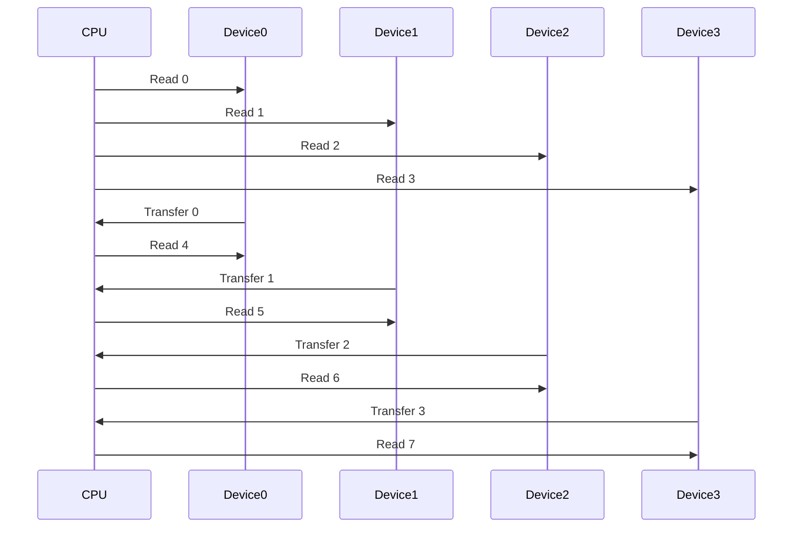

# Chapter 2: Computer Memory Systems
## 2.1 The Memory Hierarchy
Memory in modern computer systems is a collection of many different devices with different physical characteristics and modes of operation, because no mory device possesses all the characteristics we consider ideal. By combining multiple types of memory devices in one system, we hope to obtain the advantages of each while minimizing their disadvantages. 
### 2.1.1 Characteristics of an Ideal Memory

| Desired Attribute | Description |
| ----------------- | ----------- |
| Low cost | Ideally memory would be as inexpensive as possible so that we can afford all we need. In order to make a fair cost comparison, we generally refer to the price of memory per amount of storage. (Ex. dollars per gigabyte) |
| High speed | Every type of memory has an associated *access time* (time to read or write a single piece of information) and *cycle time* (the time between repetitive reads or writes; sometimes, due to overhead or device recovery time, the cycle time is longer than access time). The shorter the access and cycle times, the faster the device. Practically, in order to keep our CPU busy rather than waiting, we need to be able to access information in memory in the same or less time that it takes to perform a computation. Thus, while the current computation is being performed, we can store a previous result and obtain the operand for the next computation. | 
| High density | High *information density* means we are able to store a great deal of information in a small physical space. We might refer to the number of gigabytes or terabytes that can be stored in a given area of circuit board space, or more appropriately, in a given volume (cubic inches or cubic centimeters). | 
| Nonvolatile | Many memory technologies are *volatile*; they require continuous application of power in order to retain their contents. Some types of memory, like the DRAM used as main memory in most systems, require not only continuous power but periodic refresh of stored information. Such a memory is volatile in more ways than one. Nonvolatile memory is ideal, as it maintains its stored information indefinitely in the absence of power and outside intervention. |
| Read/write capable |  Memory devices that allow the user to readily store and retrieve information are called *read/write memories* (RWMs). The less desirable alternative is a memory with fixed contents that can only be read; such a device is called a *read-only memory* (ROM). Of course, a write-only memory that allwed storage but not retrieval wouldn't make much sense. There are also some memory technologies that allow writes to occur, but in a way that is more costly (in terms of time, overhead, device life, or some other factor) than reads. We might refer to such a device, like flash memory, as a "read-mostly memory". A RWM is usually preferred over other types. |
| Low power | Volatile memory devices require continuous application of power. Even nonvolatile memories, which can maintain their contents without power, require power for information to be read or written. Sometimes this is a relatively minor consideration; in other applications, such as when heating is a problem or a system must ron off batteries, it is critical that our memory system consume as little power as possible. Memory that consumes less power is always better. |
| Durability | Ideally our memory system would last forever, or at least until the rest of the system is obsolete and we are ready to retire it. Based on historical data and knowledge of their manufacturing processes, memory device manufacturers may provide an estimate of the mean time between failures (MBTF) of their products. This is the average time a given part is supposed to last. (The life of any individual device may vary quite a bit from the average.) They may also express the expected lifetime of a product in other ways, such as in terms of the total number of read or write functions it should be able to perform before failing. (For this to be useful, one must estimate how frequently the device will be accessed during normal operations.) Durability may also be interpreted in terms of a device's ability to survive various forms of abuse: impact, temperature and humidity extremes, etc. In general, memory technologies that do not use moving mechanical parts tend to last longer and survive more mistreatment than those that do. |
| Removable | In many instances, it is advantageous to be able to transport memory (and preferably its contents) from one computer system to another. This facilitates sharing and backing up information. In rare situations when physical security of information is important (like government or trade secrets), being able to remove memory may be considered undesirable. In most cases it is a desirable feature, and in some cases essential. |

The goal is to create a memory system that is fast, has high storage capacity, is readable and writable, maintains its contents under as many scenarios as possible, and yet is as inexpensive and convenient to use as possible.

### 2.1.2 Characteristics of Real Memory Devices
The most popular types of memory are semiconductor chips (integrated circuits) and magnetic and optical media. There are several subtypes using each of these technologies, and each of these has some advantages. 

*Semiconductor memories* in general possess the advantage of speed. This is why the main memory space of virtually all modern computers is populated exclusively with semiconductor devices, and magnetic and optical devices are relegated to the role of secondary or tertiary (backup) storage. The CPU is built using semiconductor technology, and only a similar memory technology can keep up with processor speeds. In fact, not all semiconductor memories can operate at the full speed of most modern CPUs. As such, the vast majority of semiconductor main memory systems have an associated cache memory made up of the very fastest memory devices.

The semiconductor memory technology with the highest information density is *dynamic random access memory* (DRAM). Due to that, because it is read/write memory, and because it has a relatively low cost per gigabyte, DRAM is used for the bulk of main memory in most computer systems. A DRAM device consists of a large array of capacitors (electrical devices capable of storing a charge). A charged capacitor is interpreted as storing a binary 1, and an uncharged capacitor indicates binary 0. Unfortunately, the capacitors in a DRAM device will discharge, or leak, over time; thus, to be able to continue to distinguish 1s from 0s and avoid losing stored informatoin, the information must periodially be read and then rewritten. This process is called dynamic RAM *refresh*. It adds to the complexity of the memory control circuitry, but in general this is a worthwhile trade-off due to the low cost and high storage density of DRAM.

Given the desired main memory size in most systems, compared to the amount of DRAM that can be fabricated on a single integrated circuit (IC), DRAM is not usually sold as individual chips. Rather, several ICs are packaged together on a small printed circuit board module that plugs into the system board, or motherboard. These modules come in various forms, the most popular of which are known as *dual inline memory modules* (DIMMs) and *small outline dual inline memory modules* (SODIMMs). Some of these modules are faster (lower access times and/or higher synchronous clock frequencies) than others, and different types plug into different size sockets (thus it is important to buy the correct type), but they all use DRAM devices as the basic storage medium. 

Although dynamic RAM offers relatively low cost and high density storage, in general it is not capable of keeping up with the full speed of modern microprocessors. Capacitors can be made very small and are easy to fabricate on silicon, but they take time to charge and discharge; this affects the access time for the device. The highest-speed semiconductor read/write memory technology is referred to as *static random access memory* (SRAM). In an SRAM, the binary information is stored as the states of latches or flip-flops rather than capacitors. (In other words, SRAM is built similarly to the storage registers inside a CPU.) SRAM is less dense than DRAM (it takes more space to build a static RAM cell than a capacitor) and therefore more expensive per amount of storage. SRAM, like DRAM, is a volatile technology that requires continous application of electrical power to maintain its contents. However, because the bits are statically stored in latches, SRAM does not require periodic refresh. Contents are maintained indefinitely as long as power is applied. Compared to DRAM, SRAM circuitry requires more power for read/write operation, but some SRAMs (like the Complementary Metal Oxide Semiconductor (CMOS) static RAM devices sometimes used to retain system settings) require very little current in standby mode and thus can maintain stored information for years under battery power. 

Semiconductor read-only memories (ROMs), including *programmable read-only memories* (PROMs) and *erasable/programmable read-only memories* (EPROMs), are roughly comparable to SRAM in cost and density though they generally operate at DRAM speeds or slower. They are nonvolatile but have the major limitation of not being writable (EPROMs can be reprogrammed in a separate circuit after erasure with ultraviolet light). As such, ROMs are only useful in limited applications, such as single-purpose embedded systems, video game cartridges (or disks), and the basic input/output system (BIOS) that contains the bootstrap code and low-level input/output I/O routines for most typical computer systems.

Semiconductor "read-mostly" memories include *electrically erasable programmable read-only memories* (EEPROMs) and their technological descendants, *flash memories*. These memories are nonvolatile, but (unlike ROMs) they are rewritable in-circuit. Writes, however, can take significanlty longer than reads to perform and in some cases must be done as 'block' writes rather than individual memory locations. Also, these devices are more expensive than most other semiconductor memories and can only be rewritten a limited number (usually a few tens or hundreds of thousands) of times, so they are not suitable for populating the entire main memory space of a computer. Instead, read-mostly memories are typically used for special purpose applications, such as digital cameras, portable thumb drives, hybrid drives, tablets, and smartphones.

*Magnetic memories* have been in use much longer than semiconductor memories, almost as long as there have been electronic computers. Mainframe computers of the 1950s often used rotating magnetic drums for storage. A few years later, magnetic *core memory* became the standard technology for main memory and remained so until it was replaced by integrated circuit RAM and ROM in the 1970s. Magnetic core memory, like all magnetic memories, offered the advantage of nonvolatility (except in the presence of a strong external magnetic field). Access times were on the order of microseconds, so this technology fell out of favor when faster semiconductor memories became cost-competitive. Another related (but slower) technology, *magnetic bubble memory*, was once thought ideal for long-term storage applications but could not compete with inexpensive disk drives, battery-backed SRAMs, and EEPROMs; it eventually died out. Ferroelectric RAM (FeRAM), another descendant of core memory, is still in production but has never caught on widely due to its much lower information storage density as compared with DRAM and flash memory. 

Magnetic storage in most modern computers is in the form of disk and tape drives. Access times for magnetic disks are on the order of milliseconds or longer, so this technology is useful only for secondary storage, not main memory. Tape drives are even slower due to the frequent necessity of traversing a long physical distance down the tape to access requested information. The chief advantages of magnetic memories, besides nonvolatility, are very low cost per gigabyte of storage and extremely high information density (a hard drive can store a terabyte or more of data in a few cubic inches of space). Removable disks and tape cartridges (and some hard drives) also offer the advantage of portability.

Although magnetic memories are currently relegated to secondary storage applications, *magnetic RAM* (MRAM) is a developing memory technology that has the potential to eventually replace DRAM in main memory applications. MRAM operates on the principle of magnetoresistance, where an electric current is used to change the magnetic properties of a solid-state material. Pieces of this material are sandwiched between two perpendicular layers of wires. A bit is stored at each point where one wire crosses over another. To write a bit, a current is passed through the wires; changing the polarity of the magnet changes the electrical resistance of the sandwiched material. Reading a bit is accomplished by passing a current through wires connected to a sandwich and detecting its resistance; a high resistance is interpreted as binary 1 and a low resistance as binary 0.

Because the bits are stored as magnetic fields rather than electrical charge, MRAM (like other magnetic memories) is nonvolatile. If it can achieve denisty, speed, and cost comparable to DRAM, MRAM will enable the devopment of "instant-on" computers that retain the operating system, applications, and data in main memory even when the system is turned off.[^1]

[^1]: Several companies, including IBM, Honeywell, Everspin, and Cypress Semiconductor, have produced MRAM devices in limited quantities. However, perhaps due to continued high demand for DRAM and flash memory, manufacturers have been hesitant to commit resources (money and fabrication plants) to high-volume production of MRAM chips. If and when they are mass produced, MRAM devices could largely replace DRAM in computer main memory applications within a few years.

*Optical memories* are becoming more and more common, all the way down to low-end computers. Even inexpensive personal computers often have an optical drive that can at least read and often write various types of optical discs including *compact disk* CDs, *digital versatile disks* DVDs, and/or *Blu-ray disks* BDs. Depending on type, an optical disk can store anywhere from several hundred megabytes of data (CD) to as much as 50 GB (BD) at a typical price of less than \$1 
each. In addition to their low cost, optical disks offer most of the same advantages (portability, nonvolatility, and high density) of magnetic disks and also are immune to erasure by magnetic fields. They are much too slow to be used for main memory, however, and the writing process takes considerably longer than writing to a magnetic disk. Their most common uses are for distribution of software and digitally recorded media, and as an inexpensive backup/archival data storage.

### 2.1.3 Hierarchical Memory Systems
It makes sense to use a mixture of different types of devices in a system in order to try to trade off the advantages and disadvantages of each memory technology. We try to design the system to maximize the particular advantages of each type of memory while minimizing, or at least covering up, their disadvantages. In this way, the overall memory system can approximate our ideal system: large in capacity, dense, fast, read/write capable, and inexpensive, with at least some parts being removable and the critical parts being nonvolatile. The typical solution is a computer system design on which a hierarchy of memory subsystems is made up of several types of devices, as depicted below, first conceptually, then within the example of typical modern computers:

Note that the upper levels of the hierarchy are the fastest but the smallest in terms of storage capacity. This is often due at least somewhat to space limitations, but it is mainly because the fastest memory technologies, like SRAM, are the most expensive. 

Because the higher levels of the memory hierarchy have smaller capacities, it is impossible to keep all the information (program code and data) we need in these levels at one time. In practice, each higher level of the hierarchy contains only a subset of the information from the levels below it. The fundamental idea underlying the hierarchical memory concept is that we want to make as many accesses (as a percentage of total) as we can to the upper levels of the hierarchy while only rarely having to access the lower levels. Thus, the resulting overall memory system approaches the speed of the highest levels while maintaining a capacity and cost per gigabyte approximating that of the lowest levels. 

Optimizing the performance of memory systems has always been a big problem due to technological and cost limitations. For the vast majority of tasks, computer systems tend to require much more code and data storage than computational hardware. Thus, it is generally not cost-effective to build the memory system using the same technology as the processor. Over the history of computers, CPUs have increased in speed (or decreased their clock cycle times) more rapidly than memory devices. There has always been a performance gap between the CPU and main memory (and a much bigger gap between CPU and secondary memory), and these gaps have increased with time. Design techniques that effectively close the gap are more important now than ever. The question has been: 'How do we fix things so the memory system can keep up with the processor's demand for instructions and data?' The rest of this chapter examines several techniques to that end.

## 2.2 Main Memory Interleaving
We previously mentioned that the storage capacity of individual memory chips is such that a number of devices must be used together to achieve the desired total main memory size. This is unfortunate from a packaging and parts count standpoint, but has some advantages in terms of fault tolerance and flexibility of organization. Constructing main memory from several smaller devices or sets of devices allows the designer to choose how the addressed locations are distributed among the devices. This distribution of memory addresses over a number of physically separate storage locations is referred to as *interleaving*. Given a particular pattern of memory references, the type of interleaving used can affect performance.

### 2.2.1 High-order Interleaving
This is the simplest and most common way to organize a computer's main memory when constructing it from a number of smaller devices. A simple example would be the design of a 64 KB memory using four
$18\mathrm{K} \times 8 \ \mathrm{RAM}$
devices:

A memory with 
$64\mathrm{K}$
 (actually 
$65,536$
 or 
$2^{16}$
) addressable locations requires 
$16$
 binary address lines to uniquely identify a given location. In this example, each individual device contains
$2^{14} = 16,384$
locations and thus has 
$14$
 address lines. The low-order
 $14$
 address bits from the CPU are connected to all four devices in common, and the high-order two address bits are connected to an address decoder to generate the four chip select (CS) inputs. Because the decoder outputs are mutually exclusinve, only one of the four memory devices will be enabled at a time. This device will respond to its address inputs and the read/write control signal by performing the desired operation on one of its
 $2^{14}$
 byte-wide storage locatoins. The data to be read or written will be transferred via the data bus.

 The operation of the memory system would not be materially altered if smaller devices were used. If 'narrower' devices (say, 
 $16\mathrm{K} \times 8$
 or 
 $16\mathrm{K} \times 1$
 ) were available, we would simply replace each
 $16\mathrm{K} \times 8$
 device with a bank of multiple devices, and each smaller device would be connected to a subset of the data bus lines. If we were to use 'shallower' devices, such as 
 $8\mathrm{K} \times 8$
 memory chips, each chip would require fewer of the low-order address lines (in this case 13 instead of 14) and we would need a larger address decoder (3 to 8 instead of 2 to 4) to generate the additional chip selects from the high-order address lines. The basic theory of operation would be the same.

 The distribution of memory addresses over the several devices (or banks of devices) in this high-order interleaved system is such that the consecutively numbered memory locations are in the same device, except when crossing a
 $16\mathrm{K}$
 boundary. In other words, device
 $0$
 contains memory locations
 $0$
 through 
 $16,383$
(
$0000000000000000$
through
$0011111111111111$
binary, or
$0000$
through
$3\mathrm{FFF}$
hexadecimal). Device
$1$
contains locations
$16,384$
through 
$32,767$
, device 
$2$
contains locations
$32,768$
through
$49,151$
, and device 
$3$
contains locations
$49,152$
through
$65,535$
.

This high-order interleaved memory organization is simple, easy to understand, requires few external parts (just one decoder), and offers the advantage that if one of the devices fails, the others can remain operational and provide a large amount of contiguously addressed memory. In our example, if device 
$0$
or 
$3$
fails, we would still have 
$48 \mathrm{KB}$
of contiguous memory space, and if device 
$1$
or 
$2$
fails, we would have one working
$32 \mathrm{KB}$
block of memory and one
$16 \mathrm{KB}$
block. It also has the beneficial side-effect that if the memory system is to be dual- or multiported (accessible from more than one bus, as in a system with multiple processors) and if the necessary hardware is added to support this, then much of the time access may occur to separate banks simultaneously, thus multiplying the effective memory bandwidth. 

The disadvantage of high-order interleaving (when used with a single data/address bus) is that at any given time, all but one of our memory devices (or banks of devices) are idle. This one device or group of devices will respond to a read or write request in its specified access time. The memory system as a whole will only be as fast as any one device. 

### 2.2.2 Low-order Interleaving
High-order memory interleaving is the default organization for most main memory systems. *Low-order interleaving* is the type of interleaving used to improve bandwidth to a single processor (or any other device capable of reading and writing memory). 

The difference from high-order interleaving is in how we map the memory addresses across the different devices or groups of devices. Returning to the 
$64\mathrm{KB}$
memory example, instead of connecting the low-order 14 address bits from the CPU to all four devices in common, we connect the higher-order 14 bits; and rather than connect the high-order two address bits to the external decoder, we generate the four chip select inputs by decoding the two lowest-order address bits. The decoder outputs are still mutually exclusive, so still only one of the four memory devices will be enabled at a time. So what is the point?

The important difference between this example and the prior is in the permutation of memory addresses over the several devices. There are still a total of 
$65,536$
memory locations equally divided over the four chips, but now consecutively numbered memory locations are always in different devices. The addresses are assigned in rotation, such that device
$0$
contains memory locations
$0,\ 4, \ 8, \ 12, \ ...$
through
$65,532$
(all the ones whose binary addresses end in 
$00$
). Device
$1$
contains all the locations with binary addresses ending in 
$01 \ (1, \ 5, \ 9, \ 13, \ ..., \ 65,533)$
. Devices
$2$
and
$3$
, respectively, contain all the locations with addresses ending in binary
$10$
and 
$11$
. Thus, if we access sequentially numbered memory locations, the accesses will be distributed over all four devices on a rotationg basis. 

The big advantage of this organization is, given a fast enough bus and some extra hardware[^2], it is possible to have several memory accesses in progress at the same time. The likelihood of being able to take advantage of this low-order interleaving scheme is high because computer systems frequently access sequentially numbered memory locations consecutively. 

For example, program instructions are stored and executed sequentially except when that order is modified by control transfer instructions. Block I/O transfers are normally done to or from sequential locations in a memory buffer. Many data structures (arrays, lists, strings, etc.) are stored consecutively in memory. Even scalar variables are often grouped together by compilers into a contiguous block of memory.

[^2]: To allow separate latching of the addresses and transfer of data for each of the devices or banks of devices. 

In a low-order interleaved system, any time we access consecutively numbered memory locations, each successive access is to a different device. This allows a significant performance improvement over high-order interleaving because it is not necessary to wait for the current memory access to complete before starting the next one. 

>Suppose that in our example we want to read memory locations 
$0$ 
through
$63$
in succession. 

>We initate a read operation to location
$0$
, which is in device
$0$
; say the cycle time for the memory device is 
$t$
nanoseconds. After
$\frac{t}{4}$ 
ns have passed, we initiate a read operation to location
$1$
. (We can do this because this location is in device
$1$
, which is currently idle.) 

>Another
$\frac{t}{4}$ 
ns later, we start a read operation on location
$2$
, which is in device
$2$
; after another 
$\frac{t}{4}$ 
ns, we start a read of location
$3$
in device
$3$
. 

>At this point, we have four memory accesses in progress simultaneously. After four
$\frac{t}{4}$ 
intervals, the data from the read of location
$0$ 
are placed on the bus and transferred to the CPU. Device
$0$
is now free again, and we can initiate the read of location
$4$
from that same device. 

>In another
$\frac{t}{4}$ 
ns, we will tranfer the contents of location 
$1$
and start the reading location
$5$
; 
$\frac{t}{4}$ 
ns later, we will transfer the contents of location
$2$
and start the read of location
$6$
; and so on, rotating among the four devices until we transfer the contents of all 64 memory locations. 

>By overlapping memory accesses and keeping all four devices busy at the same time, we will get the entire job done in approximately one quarter the time that would have been required if the system used high-order interleaving.

Locations need not be accessed in sequential order to realize a performance benefit. Any access pattern that is relatively prime with the interleaving factor will benefit just as much. 
> For example in our four-way interleaved system (the number of *ways* is the interleaving factor, generally a power of two due to binary addresses), if we were to access locations
$0, \ 5, \ 10, \ 15, \ ...$
or
$2, \ 9, \ 16, \ 23, \ ...$
we could still get the full speed-up and have an average cycle time of
$\frac{t}{4}$

> If we tried to access every second memory location (
> $3, \ 5, \ 7, \ 9, \ ...$
> ), we would lose some but not all of the potential speed-up. The accesses would be spread over two of the devices, so our average steady-state cycle time would be 
> $\frac{t}{2}$

> The worst case scenario would occur if we tried to access every fourth memory location (
> $0, \ 4, \ 8, \ 12, \ ...$
> ), or every eighth, etc. (any interval composed of an integer multiple of the interleaving factor) If this occurs, we will continually access the same device, and effective cycle time will revert to 
> $t$
> . 

The obvious benefit of a low-order main memory interleave is that, when transferring data to from a single device (ie, CPU) we can achieve a speed-up approaching 
$n$
where
$n$ is the interleaving factor. In the best case (sequential access), an 
$n-\mathrm{way}$
low-order interleave using devices with a cycle time of 
$t$ can give us the same performance as a noninterleaved or high-order interleaved memory built using devices with a cycle time of 
$\frac{t}{n}$
(which would likely be more expensive).

> An 8-way low-order interleave of
> $10 \ \mathrm{ns} \ \mathrm{DRAMs}$
> could, under ideal conditions, approximate the performance of a much costlier 
> $1.25 \ \mathrm{ns} \ \mathrm{SRAMs}$
> .[^3]

[^3]: Even in real computing in which not all accesses are sequential, we can often achieve enough of a performance increase for low-order interleaving to be worthwhile. 

Low-order interleaving's most obvious disadvantage is an increase in hardware cost and complexity. A high-order interleaved system (or a noninterleaved system built from a monolithic device) can have a very simple, inexpensive bus interface because only one memory access is in progress at a time. When low-order interleaving is used, it becomes necessary to multiplex the addresses and data values for up to 
$n$
simultaneous transactions across the same bus. This requires very fast bus connections and associated hardware (decoders, latches, tranceivers, etc.) as these have to do 
$n$
times the work in the same amount of time. The additional hardware required, even using very fast component, has some propagation delay that may cut into the potential speed-up. The alternative would be to make the bus
$n$ 
times as wide as the size of an individual addressable memory location. (
$32$
bits wide in our example of a four-way interleave of
$8$
bit devices) This also increases the cost of implementation.

One other potential disadvantage of low-order memory interleaving in systems with multiple processors (or other devices that need to access memory) is that the memory system is designed to maximize the bandwidth of transfers to or from a single device. So, if one processor is taking advantage of accessing sequentially numbered memory locations, it is using up the full bandwidth of all the memory devices and there is no opportunity for any other processor (or device) to access memory without halting the first. If main memory is large with respect to the size of the individual devices, a remedy may be using high and low-order interleaving in the same system. 

The memory addresses would be divided into not two, but three logical parts; both the upper and lower bits would be externally decoded. The upper bits would select an address range composed of sets of devices; the low-order bits would choose a device or set of devices, permuted by address, within this larger set. The middle bits would be decoded internally by the devices to select a particular location. This combined interleaving scheme is the most complex and costly to implement but can be worthwhile in systems in which fast access to a large memory space is needed. This combined interleaving scheme is the most complex and costly to implement but can be worthwhile in systems that need fast access to a large memory. 

## 2.3 Logical Organization of Computer Memory
The underlying assumption of our discussion of main memory was the random access property. We know that the bulk of main memory in most computer systems is semiconductor RAM.[^4] However, certain types of computer memory (including those potentially critical to system performance) are not random access in their logical organization. (Notably, *sequential access* and *associative* memories.)

[^4]: Though portions of memory that are required to be nonvolatile may be constructed of ROM, flash, etc.

### 2.3.1 Random Access Memories
Main memory, for the most part, is made of RAM. Computer programs do not really access memory at random, but according to some programmed sequence in order to carry out a given task. When they access memory, they do so by generating a number, called the *address*, of the location to be read or written. The important property of RAM is that all locations are created equal when it comes to reading or writing. In other words, if a memory location is to be read, any arbitrarily (or randomly) chosen location can be read in the same amount of time. Likewise, any location in a writeable RAM can be written in the same amount of time. 

From this definition, it is clear that semiconductor DRAMs and SRAMs are not the only random access memories in computer systems. ROMs (and associated technologies like PROM, EPROM, EEPROM,etc.), flash memories, and some other devices have the property of equal read access time for all locations and thus may correctly be referred to as RAMs.[^5]

[^5]: A more correct term for semiconductor RAM is read/write memory to distinguish it from read-only or read-mostly memories, many of which are also random access in their organization.

In any RAM (DRAM, SRAM, ROM, etc.) each memory location is identified by a unique binary address. An addressed location may consist of an individual bit, but generally addresses are assigned to bytes (groups of 8 bits) or words (groups of a specified number of bits, depending on the particular architecture). As such, *absolutely addressed memory* is often used as a synonym for RAM.[^6] 

[^6]: Strictly speaking, some types of memory (such as magnetic bubble memories and charge coupled devices) are absolutely addressed but not truly random access. These technologies have generally fallen out of favor, the distinction has mostly been lost. 

All of the RAMs we have discussed (except the ones with addresses for individual bits) are accessed by what we call a *word slice*: all the bits in a given numbered word are accessed at the same time:

We present the address
$i$
of a word and can then read or write all the bits of word
$i$
simultaneously. There is no mechanism for reading or writing bits from different words in one operation. This is usually fine, though some particular applications (graphics, certain types of array processing, etc.) can benefit by being able to access information by *bit slice*. If we want to read or write bit 
$j$
of all or some defined subset of the memory locations, we need memory access by bit slice:

We could create a bit-slice-only memory easily enough by rearranging the connections to a regular RAM. (Though we could no longer access it by word slice.) If we needed to be able to access information by bit slice or word slice, we could construct an *orthogonal memory*:

Orthogonal is a term in geometry meaning perpendicular. The name describes our perception of bit slices and word slices as being logically perpendicular to each other. Orthogonal memories are not seen very often in general purpose computers, but have been used in special machines such as the Goodyear Aerospace STARAN computer (an array processor developed in the early 1970s). Our main purpose in mentioning them is to point out that special problems sometimes need special solutions; there are other ways, besides word slice, to address a RAM.

### 2.3.2 Sequential Access Memories
A second frequently used type of memory system is called *sequential access memory* (SAM). Information is stored by recording it on a physical medium (like magnetic or punched paper tape) that travels past a read/write mechanism or *head*. In order to read or write information in a particular location, the tape must physically move past the head. It is obvious that such a tape is not a random access memory; a location closer to the present position of the read/write head can be accessed more quickly than one that is far away. 

> If the head is currently at position
> $n$
> and we want to access location
> $n+5$
> , we must first advance sequentially past locations
> $n+1$
> , 
> $n+2$
> ,
> $n+3$
> , and
> $n+4$
> . If instead we wanted to access location
> $n-50$
> , we would have to move 50 positions down the tape in the opposite direction. 

With other types of sequential access memory, access may be sequentail in more than one dimension. In the case of magnetic and optical disks, for example, both the radial distance the head must be stepped in or out from the center spindle, and the angular distance around the head's path must be specified and traversed to access the desired information. 

In a sense, sequential access memories are also addressed, but in a different way from RAMs. Instead of finding the desired item using its *absolute address* (its unique binary identifier), the important concept in sequentially organized memory is the *relative address* of the information, which tells us not specifically where it is but rather how far it is from our current position in a particular direction. When relative addressing is used in a SAM, the location number and access time is proportional to the distance between the current and desired locations.

Because of the uniformity of addressing and access times, RAMs can easily be interfaced in a synchronous or asynchronous fashion, as the designer prefers. SAMs, practically speaking, can only use an asynchronous interface because synchronous transfers of data would always have to allow for the worst case access time (which may be very long). Thus, disk and tape drives never interface directly to the CPU, but rather connect indirectly through a drive controller. Because of their simplicity and flexibility in interfacing with a (synchronous) CPU, RAMs are preferred by system designers and are essential for main memory. Yet, the advantages of magnetic and optical disk memories in terms of cost, storage density, and nonvolatility ensure that SAMs will be used (at least in secondary storage applications) for some time to come.

### 2.3.3 Associative Memories
*Associative memories*, or *content addressable memory* (CAM), are radically different from the two discussed prior. Both random access and sequential access memories identify stored information by its location, either in an absolute or relative sense. Associative memories identify stored information by the actual content that is stored, or some subset of it. Rather than provide an absolute or relative address for a memory location for a read/write, we specify the contents we are looking for, and see if the memory system has anything matching that. 

If we know the contents of an 8-bit memory location are supposed to be
$01101101$
, it doesn't do much good just to verify that. The real power and utility of an associative memory is the ability to match on a selected part of the contents, which we know, in order to obtain related information we seek. 
> We might find it more useful to ask the memory whether it contains any entries with bit
> $0$
> equal to 
> $1$
> and bit
> $3$
> equal to
> $0$
> , or to provide us with the first entry that starts with the bit pattern
> $011$
> or some other partial contents.

This is directly analogous to a software database application that allows us to look up a customer's information if we know their name or phone number. An associative memory does the same thing in hardware and is thus much faster than a software search. 

In making an associative query of a memory system, we need to identify three things:
1. *argument*, or search term - the word we are trying to match memory contents against
2. *mask* or *key* that identifies which bit positions of the argument to check for a match on and which to ignore
3. some sort of control over conflict resolution, or at least a way to detect conflict (multiple matches)

Any associative search may produce no matches, a unique match, or several matches. Knowing which of these events has occurred is often significant. If we want to update the stored information, it is important to detect the lack of a match so the write can be aborted, or multiple matches to deterine which location(s) to update.

Block Diagram of Associative Array:

| component | designation | description |
| --------- | ----------- | ----------- |
| *argument register* | A | holds the item to be searched for |
| *key register* | K | bits equal to 1 indicate positions to check for a match, 0s denote postions to be ignored |
| *match register* | M | stores search results - one bit for each word in the associative array. if the logical OR of all the match register bits is 0, no match was found. if it is 1, at least one match was found. examining the individual bits of M allows us to determine how many matches occured and in what location(s) |

To construct the associative array itself, the memory cells could be constructed of capacitors (such as DRAM), flip-flops (such as SRAM), or some other technology. Because the main purpose of associative memory is to be able to perform a high-speed search of stored information, we will assume that each bit of data is stored in a D flip-flop or similar device. The mechanism for reading and writing these bits is the same as it would be for any static RAM.
> To store a bit, we place it on the D input and clock the device. To read a stored bit, we look at the state of the Q output.

Additional logic is required in order to perform the search and check for matches. This logic will decrease the density of the memory cells, increase power consumption, and add considerably to the cost per bit of fabricating the memory (but it may be worth it in terms of speeding up the search). 

Associative Memory Cell Logic:

This diagram shows logic that could be used for an individual associative memory cell. To store all 
$n$
bits of a word will require
$n$
flip-flops, and an associative array with 
$2^m$
words will require
$2^m \times n $
flip-flops.

| | | 
| -- | -- |
| $Q_i$ | represents the ith bit of a word. |
| $A_i$ | the corresponding bit of the argument to be searched for, must be compared to the $Q_i$ bit in every word simultaneously. |
| $K_i$ | key bit |
| $M_i$ | match bit |

The equivalence gate (Exclusive-NOR or [XNOR](https://github.com/nicoleavans/computer-architecture-notes/blob/main/Fundamentals%20and%20Principles/Apocrypha.md)) outputs a logic
$1$
if the stored bit matches the corresponding bit of the argument. This gates output is logically ORed with the inverse of the corresponding key bit
$K_i$
to indicate a match
$m_i$
in this bit position. 

This is because, if
$K_i = 0$
, this bit position is a "don't care" for the purposes of matching, so we don't want a mismatch between
$A_i$
and
$Q_i$
to disqualify the word from matching. Bit 
$m_i$
will be
$1$
if either
$A_i = Q_i$
or
$K_i = 0$
. All of the individual bit position match bits
$m_i$
for the word can then be ANDed together to detect a match between the argument and that ord and generate the corresponding bit to be stored in the match register M. If at least one bit of M is
$1$
, the selected bits (according to the key) of the argument are contained in memory.

The advantage of going to the effort and expense of an associative memory is search speed. All the bits of all the words in the memory are compared to the argument bits simultaneously (in parallel). Rather than perform a search sequentially in software by examining one word after another, we have effectively built the search function into the hardware. Finding a match in any word; whether the first, last, or anywhere in between (or even multiple words), takes the same brief amount of time. Software search engines take a variable and generally much longer time to complete. 

The choice between a parallel search using a CAM and a sequential search through the contents of RAM boils down to a trade-off of competing criteria. 
* RAM is much more information dense, cheaper, and less complex to build. RAM is useful for a much wider range of applications, but takes a long time to search.
* CAM gives much better peformance for a particular application (search), but offers little if any assistance to most other computing functions. It is much higher in cost and complexity for the same storage capacity. Its use as a main memory would only be economically justified in systems tailored to very specialized applications. (General-purpose machines can benefit from using a small amount of associative memory in a particular way to improve overall main memory performance.)

## 2.4 Cache Memory
Low-order interleaving is one way to try to improve performance, but it has limitations, and performance improvement realized is dependent on precise ordering of memory references. Main memory *caching* is a somewhat more general way of improving main memory performance.

A *cache memory* is an high-speed buffer memory that is logically placed between the CPU and main memory. (It may be physically located on the same integrated circuit as the processor core, nearby in a separate chip on the system board, or both.) Its purpose is to hold data and/or instructions that are most likely to be needed by the CPU in the near future so that they may be accessed as rapidly as possible - ideally, at the full speed of the CPU with no 'wait states', which are usually necessary if data are to be read or written to main memory. The idea is that if the needed data or instructions can usually be found in the faster cache memory, then that is so many times the processor will not have to wait on a slower main memory. The concept of cache goes back at least to the early 1960s, when magnetic core memories (fast for the time) were used as buffers between the CPU and main storage, which may have been a rotating magnetic drum. 

The word *cache* comes from the French verb *cacher*, "to hide". The operation of the cache is transparent to (hidden) from the programmer. The programmer's code (with no effort on their part) runs invisibly from cache, and main memory appears to be faster than it really is. The effort is expended in the design and management of cache rather than in programming. 

### 2.4.1 Locality of Reference
Typically, due to cost factors, cache is much smaller than main memory. (Modern cache is built from more expensive SRAM rather than DRAM used for main memory.) 
> A system with 4GB of main memory might have only 4MB (or less) cache. Because cache is 
> $\frac{1}{1024}$
> the size of main memory, it may seem to be of neglible benefit. If memory references were uniformly distributed throughout the address space, we would only expect one access in every 1024 to occur in the faster cache memory. In this case, the additional expense of a cache would not be justified.

Computer programs do not access memory at random. Instead, most programs confine the vast majority of their memory references for instructions and data to small areas of memory, at least over a given limited stretch of time. This observed, nearly universal behavior of computer programs exemplifies the principle of *locality of reference*. This principle states that programs tend to access code and data that have recently been accessed, or which are near code or data that have been recently accessed. This explains why a relatively small cache memory can have a large impact on memory system performance. It is fine to have a cache that is 
$.1 \%$
or less of the size of main memory as long as we make sure it contains the
$.1 \%$
of information most likely to be used in the near future.

| Aspects | of Locality of Reference |
| ------- | ------------------------ |
| *temporal*[^7] locality | if a given memory location is accessed once, there is a high probablility of its being accessed again within a short time |
| *spatial* locality | locations near a recently accessed location are also likely to be referenced | 
| *sequential* locality | specific form of spatial locality, tells us that memory locations whose addresses sequentially follow a referenced location are extremely likely to be accessed in the very near future |

[^7]: meaning time-related

Low-order interleaved memory takes advantage of sequential locality, but cache memory is a more general technique that can benefit from all three forms of locality.
> Code is typically executed sequentially. Use of loops and subroutines (functions, methods, etc.) contributes to temporal locality. Vectors, arrays, strings, tables, stacks, queues, and other common data structures are almost always stored in contiguous memory locations and referenced with loops. Different programs and data sets exhibit different types and amounts of locality. It is this property of locality that makes cache memory improve performance of main memory. 

### 2.4.2 Hits, Misses, and Performance
In the hypothetical case of 4GB main memory and 4MB cache, the cache is less than
$.1 \%$
of the size of main memory, yet for most programs the needed data may be found in the cache memory 
$90 \%$
 or more of the time.

| term | definition |
| ---- | ---------- |
| *hit ratio* | the probability of avoiding a main memory access by finding the desired information |
| *miss ratio* | the fraction of memory references not satisfied by cache |
| *cache hit* | any reference to a location that is currently resident in cache |
| *cache miss* | any reference to a location that is not cached. |

Hit Ratio Formula:

$$
\mathrm{hit \ ratio} = p_h = \frac{\mathrm{number \ of \ hits}}{\mathrm{total \ number \ of \ main \ memory \ accesses}}
$$

or, equivalently,

$$
p_h = \frac{\mathrm{number \ of \ hits}}{(\mathrm{number \ of \ hits \ + \ \mathrm{number \ of \ misses}})}
$$

The hit ratio may be expressed as a decimal in the range of 0 to 1, or as a percentage.
> If a given program required a total of 
> $142,000$
> memory accesses for the code and data but (due to locality) 
> $129,000$
> were hits and only
> $13,000$
> were misses, then the hit ratio would be:

$$
p_h = \frac{129,000}{(129,000 + 13,000)} = \frac{129,000}{142,000} = .9085 = 90.85 \%
$$

We can correspondingly define the *miss ratio* as:

$$
1 - p_h
$$

The hit ratio is never really a constant. It will vary from system to system depending on the amount of cache present and the details of its design. It will also vary on the same system depending on the current program running and the properties of the data set it is working with. Even within a given run, hit ratio is a dynamic parameter as the contents of the cache change over time.
> In our example, most of the 
> $13,000$
> misses probably occurred early in the run before the cache filled up with useful data and instructions, so the initial hit ratio was probably quite low. Later on, with a full cache, the hit ratio may have been much higher than 
> $.9085$
> . (It still would vary somewhat as different routines containing different looops and other control structures were encountered.) The overall value computed was the average hit ratio over some span of time.

With a high hit ratio (close to
$1.0$
or
$100\%$
), dramatic gains in performance are possible. The speed ratio between cache and main memory may easily be 
$10:1$ 
or greater. Cache ideally operates at the full speed of the CPU (single clock cycle access time), with main memory taking much longer.
>Let us say that in the preceding example with
$p_h = .9085$
, the main memory access time is 
$10 \ \mathrm{ns}$
(a 
$20:1$
speed ratio). What is the effective time required to access memory, on average, over all references? We can compute this simply using the following formula for a weighted average:

$$
t_{a \ \mathrm{effective}} = t_{a \ \mathrm{cache}} \times p_h + t_{a \ \mathrm{main}} \times (1-p_h)
$$

| term | value |
| ---- | ----- |
| $\mathrm{speed \ ratio}$ | $\frac{1}{20}$ |
| $\mathrm{main \ memory \ access \ time} = t_{a \ \mathrm{main}}$ | $10 \ \mathrm{ns}$ |
| $\mathrm{speed \ ratio} \times \mathrm{main \ memory \ access \ time} = t_{a \ \mathrm{cache}}$ | $.5 \ \mathrm{ns}$ |
| $p_h \ (\mathrm{hit \ ratio})$ | $.9085$ |
| $1 - p_h \  \mathrm{(miss \ ratio)}$ | $.0915$ |

$$
(.5 \ \mathrm{ns})(.9085) + (10 \ \mathrm{ns})(.0915) = .45425 \ \mathrm{ns} \ + .915 \ \mathrm{ns}  = 1.36925 \ \mathrm{ns}
$$

> The cache itself is 20x the speed of main memory. The combined system with cache and main memory is about 7.3 times as fast as the main memory alone. This is a conservative example, it is not uncommon for cache hit ratios to be in the range of 97-98% in practice. A hit ratio of 
> $.98$
> would have brought the access time down to just
> $.69 \ \mathrm{ns}$
> or aproximately 14.5x the speed of main memory. By spending a relatively small amount on 4MB of fast memory, we have achieved nearly as much improvement in performance as we would have by populating the entire main memory space (4GB) with the faster devices, but at a fraction of the cost.

It's not quite as simple as plugging extra SRAM devices in on the CPU-memory bus and expecting them to automatically choose the right information to keep while discarding items that won't be needed soon. We need circuitry to decide things like:
* which main memory locations to load into cache
* where to load them into cache
* what information already in cache must be displaced in order to make room for new information

The cache control circuitry must be able to:
* handle issues such as write to locations that are cacheable
* detect whether a location that is written is in cache
* update that location
* make sure the corresponding main memory location is updated

Though programs normally interact with memory in the form of reading or writing individual bytes or words, transfers of data or instructions into or out of cache typically are done with less granularity. Most caches are designed such that a block of data, rather than a single byte or word, is loaded or displaced at a time. *Refill line* or *line* is the unit of information that is moved between main memory and cache.
>Depending on system characteristics, line size may range from just a few (8 or 16) bytes to a fairly substantial chunk of memory, perhaps as large as 256 bytes.

Cache may be partitioned into refill lines instead of individual bytes or words for several reasons:
1. Given the typical size and performance characteristics of buses between the CPU and main memory, it is usually more efficient to perform a small number of large transfers than a large number of small ones.
2. Because of the locality principle, if a program needs a given byte or word now, it will probably need the surrounding ones soon, so it makes sense to fetch them all from main memory at once.
3. It is generally less expensive to build a cache with a small number of large entries than vice versa. (especially true of fully associative cache organization)

Thus, though line size can equal one byte or one word, it is usually larger and virtually always an integer power of 2.[^8]

[^8]: Like the size of most memories with binary addresses.

### 2.4.3 Mapping Strategies
The most notable job of the cache controller is the task of *mapping* the main memory locations into cache locations. The system needs to be able to detect a hit vs a miss to quickly determine whether or not a given main memory location is cached. Three strategies are widely used for performing this mapping.

#### 2.4.3.1 Associative Mapping
Associative mapping, sometimes called fully associative mapping, is the most flexible mapping scheme. It takes advantage of the properties of associative memories (CAM). Due to its flexibility, all else being equal, it will have the highest hit ratio and thus improve performance more than other mapping strategies. Due to its reliance on CAM, it is the most expensive type to build.

Each entry, or refill line, is composed of two parts: 
* an address *tag*, the information to be matched on associatively
* one or more data or instruction bytes/words that are a copy of the correspondingly addressed line in main memory

If a line is an individual memory location, the tag is the complete memory address of that location. If, more likely, a line contains several memory locations, the tag consists of the high-order address bits that are common to all locations in that line. 
> If the byte-addressable main memory uses 
> $32 \ \mathrm{bit}$
> addresses and each refill line contains
> $2^6 = 64 \ \mathrm{bytes}$
> , then the associative tags will be the upper
> $(32-6) = 26$
> address bits.

Layout of Fully Associative Cache:

Note that the tag storage is all CAM, but the cached information that goes with each tag is not needed in the matching process, so it can be stored in SRAM. Each tag is logically associated with one and only one line of information stored in the SRAM.

When a main memory address is referenced, it is quick and easy to determine whether it is a cache hit or cache miss. The upper bits of the main memory address are checked against all the cache tags simultaneously. We never cache the same main memory location in more than one place, so there will be either one match or none. If no tag matches the supplied tag, the access is a miss and main memory must be referenced.
> We will then place this line into the cache, displacing another line if necessary, so that subsequent references to it will result in hits.

If one tag is a match, then a hit has occurred, and the lower main memory address bits will identify which byte or word within the line is to be accessed. In this case the main memory access can be omitted.

The check for a hit is very fast because all the tags are checked at once. This cache organization is the most flexible because there are no limitations on where in the cache any given information from main memory may be mapped. Any line from main memory may reside in any line of cache. Thus, any combination of main memory contents can reside in cache at any time, limited only by the size of the cache. Due to this flexibility, hit ratios tend to be high for a given cache size. The need for a CAM to hold the tags makes this an expensive strategy.

#### 2.4.3.2 Direct Mapping
Direct mapping is the opposite extreme of fully associative mapping. Because the cost of a fully associative cache is dominated by the cost of the matching hardware required to associatively compare all the amny large tags at once, we could achieve considerable savings by reducing the number of comparisons and/or the size of the tags. A direct mapping does both of these things by sacrificing flexibility. Instead of an entry (a given item from main memory) being able to reside anywhere in cache, it is constrained to be in one particular line if it is in cache at all. The particular line into which it may be mapped is determined by part of its main memory address called its *index*.

We only have to compare the tag portion of the main memory address with one stored tag (the one with the same index) to determine whether or not a hit has occurred, because it is only possible for a given item to be in one place. Line size is independent of mapping strategy and thus could be the same in a direct-mapped cache as it might be in a fully associative cache. Fewer bits are required for tags because some of the memory address bits are used for indexing. 
> If main memory is 
> $2^n$
> bytes, and the line size is
> $2^m$
> bytes, then the tags in a fully associative cache are
> $n-m$
> bits in size regardless of the number of lines in the cache. However, in a direct-mapped cache containing 
> $2^k$
> lines, 
> $k$
> bits are used for the index, so the tags are only
> $n - k - m$
> bits long.

Direct-Mapped Cache:

> Suppose a system is to have
> $4$
> (
> $2^{32}$
> bytes) of main memory and
> $2$
> MB (
> $2^{21}$
> bytes) of cache, which is to be organized as
> $2^{15} = 32,768$
> lines of
> $2^6 = 64$
> bytes each. The 
> $32$
> address bits oould be divided into 
> $11$ tag,
> $15$
> index, and
> $6$
> byte bits as shown. To check for a cache hit on any given main memory access, the index bits are used to uniquely choose one of the
> $32,768$
> stored tags. 

That tag (and that tag only) is checked against the tag bits of the supplied address. If they match, the access is a hit; the 6 low order bits can be used to identify which location within the line is to be accessed. If they don't match, the access is a miss; main memory must be accessed.
> Let's say the CPU wants to read main memory location
> $0040018A_{16} \ (00000000010000000000000110001010_2)$
> . Although this address is a monolithic binary value as far as the CPU is concerned, for the cache it is treated as three separate values:
> * a tag of $00000000010_2$
> * an index of $000000000000110_2$
> * a byte address within a given line of $001010_2$
> 
> Because the index is
> $00000000110_2$
> or decimal 
> $6$
> , the tag in position
> $6$
> is accessed and checked. Because this tag is equal to 
> $00000000010_2$
> , the access is a hit, and the data at position
> $001010_2$
> (10 decimal) within that line is forwarded to the CPU. If the contents of the tag in position
> $6$
> had been anything other than
> $00000000010_2$
> , the access would have been a miss. 
> In that case, the previous contents of cache line
> $6$ 
> would be replaced by the contents of main memory locations
> $00400180_{16}$
> through
> $004001\mathrm{BF}_{16}$
> (the 
> $64$
> byte block including the referenced location) because, by the principle of locality of reference, those memory contents would likely be needed in the near future.

The key to cost savings using direct mapping is that no associative memory is required. Both the tags and data are stored in a fast, but normal, SRAM. (More expensive than DRAM but significantly cheaper than CAM.) Only one small comparator circuit is needed to check a single tag for a match. The trade off is a potentially lower hit ratio and thus lower overall system performance given the same cache size. 
> Suppose the program was processing two arrays: one stored beginning at location
> $004001801_{16}$
> , including the location accessed in the example, and another stored beginning at location 
> $01\mathrm{C}00180_{16}$
> . The tag portion of the address for this second array would be 
> $00000001110_2$
> instead of 
> $00000000010_2$
> , but it would have an index of 
> $000000000000110_2$
> just like the first array. With a fully associative organization, caching both arrays at the same time would be no problem - any subset of main memory contents can be cached at the same time. If the direct mapping of the example is used, these two arrays are mutually exclusive when it comes to caching. Any time elements of either array are loaded into cache, they can only go in line
> $6$
> , displacing elements of the other array if they have already been loaded.

The are three types of cache misses, classified by the reason the needed data is not currently in cache.
* *compulsory miss* (sometimes called 'first reference miss' or 'cold start miss') - the first time a program makes reference to an item in a given line-sized block of memory, it will not have been loaded into cache yet, and so a miss will occur. Subsequent references to the same block will result in hits unless that line has been evicted from cache in the mean time.
* *capacity miss* - because cache is finite in size, it is possible that the program code and/or data set will be too large to completely fit in the cache. Once it fills up, some lines that are still in use may have to be evicted to make room for newly referenced lines. The misses that subsequently occur for no other reason than because the cache is full are capacity misses. 
* *conflict misses* - occur when two or more blocks of main memory map to the same spot in the cache, and cannot occupy it at the same time. Anytime one of the conflicting blocks (such as ones with the same index but different tags) is referenced, it will cause the eviction of another that is currently cached. A subsequent reference to that (no longer cached) region of memory will cause a conflict miss.

Any cache, regardless of organization, will suffer from both compulsory and capacity misses, but fully associative memory is immune to conflict misses. There may also be a hidden performance cost with conflict misses if other operations, such as I/O, are going on in the background. Even though the cache 'fills' after each miss may be transparent to the CPU, they still consume main memory bandwith. Thus, other devices that may be trying to access main memory will have to wait.

A direct-mapped cache may not be the best choice due to performance concerns. Conversely, due to cost constraints, a fully associative cache may not be feasible. 

#### 2.4.3.3 Set-Associative Mapping
Set-associative mapping is a compromise between the two extremes of fully associative and direct-mapped cache organization. In this type of cache, a particular item is constrained to be in one of a small subset of the lines in the cache rather than in one line only (direct) or in any line (fully associative). A set-associative cache can be thought of as a group or set of multiple direct-mapped caches operating in parallel. For each possible index, there are now two or more associated lines each with its own stored tag and associated data from different areas of main memory. These different lines from main memory will be ones that would contend with each other for placement in a direct-mapped cache, but, due to the duplication of the hardware, they can coexist in the set-associative cache.

The hardware for set-associative cache is more complex than what is required for direct-mapping. For example, instead of one comparator being used to check the supplied address against the single tag with a given index, the set associative cache will require 2, 4, etc., more comparators. The cache is said to be as many 'ways' associative as there are different places to cache a given piece of information. So, a cache with four parallel sets and thus four comparators would be called a four-way set-associative cache.

When all of the lines with a given index are full and another line needs to be loaded, some sort of algorithm must be employed to determine which of the existing lines to displaced. (Whereas in a direct-mapped cache there is only one option and thus no similar choice to make.) Still, the hardware for a set-associative cache is not nearly as complex or expensive as that required for a fully associative cache.
> We still assume that there is 
> $4 \ \mathrm{GB}$
> of main memory space, so 
> $32 \ \mathrm{bit}$
> addressing is used. The
> $2 \ \mathrm{MB}$
> total cache size is the same, but now we partition it into two subdivisions of
> $1 \ \mathrm{MB}$
> and treat each as though it were an independent direct-mapped cache. Assuming that each line is still
> $64 \ \mathrm{bytes}$
> , this means there are
> $2^{14} = 16,384$
> lines in each half of the cache. So, there will be 
> $14$
> address bits instead of
> $15$
> , and the tags will consist of the upper 
> $12$
> address bits rather than
> $11$
> . On each memory reference, two 
> $12 \ \mathrm{bit}$
> tags instead of one
> $11 \ \mathrm{bit}$
> tag must be checked. The two hypothetical arrays we spoke of at main memory addresses
> $00400180_{16}$
> and
> $01\mathrm{C}00180_{16}$
> still both map to line
> $6$
> . Because there are two separate lines with index 
> $6$
> it is possible for these items to coexist in cache, though accessing a third area of main memory with the same index would necessarily displace one of them. 

If we're concerned about this displacement, we could divide the cache into four
$512 \ \mathrm{KB}$
partitions (ways) and use a four-way set associative design with a
$13 \ \mathrm{bit}$
index and four
$13 \ \mathrm{bit}$
tags to check on each access. An 8-, 16-, or more bit associative cache could be designed the same way. These more highly associative organizations are rarely used due to cost and complexity. It is rare for more than two to four widely separated areas in memory to be in frequent use at the same time. Considering benefit to cost, a 2- or 4-way set associative organization is often the best overall design for a data or mixed instruction/data cache.[^9]

[^9]: Set associative cache is the most general of the three concepts. When instructions are cached separately, a direct mapping may do virtually as well as a set-associative one, as program flow tends to be more localized than data access. A direct-mapped cache is really just a one-way set-associative cache by another name, and a fully associative cache with 
$2^k$
lines is the same as a
$2^k$
-way set associative cache with one line per way. The direct-mapped cache will have the fewest tag bits and the most index bits. As associativity increases for the same cache size, the number of index bits decreases and the number of tag bits increases. Ultimately, in the fully associative case, there are 
$0$
index bits, and the tags are the maximum size, which is the entire main memory address minus the number of bits that identify a specific location within a line.

### 2.4.4 Cache Write Policies
Cache operation using any of the three mappings discussed prior is fairly straightforward as long as memory accesses are limited to reads. This may be possible in an instruction-only cache. However, in a cache for a system with a split (modified Harvard) cache architecture, or in a unified (Princeton or mixed instruction/data) cache, writes are needed. 

When a line is displaced from cache and the contents of that line have only been read, the line is simply overwritten by the new data. If the contents of that line have been written, a write must be performed to main memory to reflect the updated contents before loading new data in their place. This has two main approaches.

#### 2.4.4.1 Write-Through Cache
*Write-through cache* is the simplest approach to keeping main memory contents consistent with cache. Every time we write to location in cache, we also write to the corresponding main memory location. Typically they can be started simultaneously, but the main memory write takes longer and extends overall time for the write operation.

It is relatively simple to build this method into the hardware. Due to write-throughs, main memory always has the most current data. This is irrelevant to the CPU as subsequent reads will hit cache and get recent data anyway. However, if there are other devices (such as DMA (Direct Memory Access) controllers or I/O processors) in the system, having main memory always updated can simplify things.

The clear disadvantage is that an item is likely to be accessed several times while in cache. All the extraneous writes exact a performance penalty - it's like we never hit on a write because all writes access main memory. The *effective* hit ratio will be lower than the actual hit ratio. 

#### 2.4.4.2 Write-Back Cache

*Write-back cache* is more complex to implement but can improve performance if writes are frequent. On a write that hits cache, only the cache location is updated. Main memory is only written when a line that has been modified is displaced from cache. Implementing this policy requires that we add a bit to each tag to indicate whether or not the associated line has been written. (Called the 'inconsistent bit' or 'dirty bit'.)[^10] 
* If this bit is 
$0$
, then this line has only been read, and cache control hardware will know a new line can simply overwrite existing information. 
* If this bit is
$1$
, then that line (or at least any modified locations within it) must be copied or 'written-back' to main memory before it is overwritten with new information. If this were not done, it would be as if the write never occurred.

[^10]: A cache location that has been written to may be called a 'dirty cell' or 'dirty word'. 

Using the write-back approach will generally maximize performance because write hits will be nearly as beneficial as read hits. 
> If we write to a cached location 10 times, only 1 write to main memory is needed. 9 of the 10 write hits took no more time than read hits.

With this approach, data in main memory can be 'stale'. We are not guaranteed that what is in main memory matches the most recent activity of the CPU. IF other devices access memory, this must be detected and dealt with. The logic required to do write-backs is more complex than that required for write-throughs. We not only need an extra bit added to every tag, we need logic to examine these bits and initiate a line write-back operation if needed. To perform a write-back, the controller must either:
* hold up the read operation for filling the new line until the write-back is complete
* buffer the displaced information in a temporary locatoin and write it back after the line fill is done

### 2.4.5 Cache Replacement Strategies

We also need to build a means of choosing which entry is to be displaced when the cache is full and a miss occurs. In a direct-mapped cache, there is only one place a given item can go, so this is simple. In a set-associative or fully associative cache there are multiple potential places to load a given line, so we must build into the control hardware a means of choosing which entry to displace. 

1. The algorithm should be simple, so that it can be implemented in hardware with little delay.
2. To maximize hit ratio, the algorithm should be effective in terms of choosing to replace a line that will not be used again for a long time.

There are several approximations of an ideal replacement strategy:

#### 2.4.5.1 LFU (Least Frequently Used)
LFU algorithm: we choose for replacement the line that has received the fewest hits so far, thinking it would likely remain the least frequently used line if left in cache. One potential problem with this approach is that lines that have been loaded very recently might not yet have a high usage count and might be displaced even though they have potential to be used more in the future.

The main problem is the complexity of the required hardware. LFU requires a counter to be built for each line in the cache in order to keep up with how many times it has been accessed. These count values must be compared each time we need to replace a line. (And, the count value for the line chosen must be reset to 0.) This complexity makes LFU impractical as a cache replacement algorithm. LRU and FIFO may achieve similar results with less complexity by attempting to replace entries with the least temporal locality, in their own ways.

#### 2.4.5.2 LRU (Least Recently Used)
The LRU algorithm replaces the line that was hit the longest ago, regardless of how many times it was used. 

#### 2.4.5.3 FIFO (First In, First Out)
FIFO replaces the oldest line - that which has been in cache the longest.

#### 2.4.5.4 Round-Robin
Some studies have show that once cache reaches sizes common in modern computers, performance is not particularly sensitive to the particular replacement algorithm used. Thus, to keep hardware simple and fast as possible, some cache designers have chosen to use the round-robin algorithm. In round-robin, candidacy for replacement is simply rotated among the cache lines.

#### 2.4.5.5 Random
Any algorithm that is simple and has little effect on performacne over the long term is a viable candidate. A random replacement strategy has some arbitrary string of bits and is used to identify the line to be replaced. Designers typically make design decisions by running simulations of cache behavior with different memory reference sequences taken from logged program runs.

### 2.4.6 Cache Initialization
How do we handle filling up a cache to start with? How do we make sure that invalid data is not read from the cache by the CPU?

Like any RAM, cache memory always contains something, whether that something is meaningful data and instructions or 'garbage'. When the system is reset, the cache will either contain residual information from before the reset or (if power was interrupted) a more or less random collection of 1s and 0s. We need to keep addresses generated by the CPU from accidentally matching one of the random tags and feeding it random garbage data (or worse, instructions).

The simplest and usual approach used to reinitialize and validate the cache uses another bit associated with each tag called the 'valid bit'. (Similar to the dirty bit used in write-back cache.) When a reset occurs, the cache control hardware clears the valid bit of every line in the cache. A tag match is not considered to be a hit unless the associated valid bit is set, forcing all initial accesses to be misses. As misses occur and valid lines are brought into cache from main memory, the cache controller sets corresponding valid bits to 1. Any tag match on a line with a 
$\mathrm{valid \ bit} = 1$
is a legitimate hit, and the cached information can be used. 

Many architectures support not only invalidating the cache in hardware on a system reset, but also under supervisor software control (by the OS). This allows all or part of the cache to be 'flushed' (for purposes of protection) on an intrrupt, context switch, or any time the operating system deems it necessary without a machine reset having to occur. Other related cache control enhancements may include mechanisms to 'freeze' the contents of cahce or to lock certain entries in place and prevent them from being evicted. The goal of all such design features is to ensure that, as much as possible, cache is kept full of valid, useful data contributing to a high hit ratio and maximum memory system performance.

## 2.5 Memory Management and Virtual Memory
The two major 'speed gaps' in most modern memory systems are the gap between the CPU and main memory speeds, and the gap between main and secondary storage speeds. Techniques like cache and low-order interleaving can help main memory appear faster than it really is to bridge the gap between CPU and main memory. Here, we learn about approaches that are used to make main memory appear much larger than it is, or alternatively, that are used to make secondary memory appear as fast as main memory and directly addressable. This way, the overall system will appear to have one large, fast, homogenous memory space rather than a hierarchy of different types of devices.

### 2.5.1 Why Virtual Memory?
In many cases, the code and data for a program are larger than the amount of main memory physically present in a given system. We may need to run that program on a variety of systems, some with less memory than others. Due to modern OS support for multitasking, other programs may be (and usually are) resident in memory at the same time. It is generally impossible to know in advance which programs will be loaded at a particular time and thus how much memory will be available for a given program when it runs. 

It is possible to divide a large program or data set into smaller sets or 'overlays' and load the needed parts under program control, unloading other parts as they are no longer needed. Each time the program needs to load or unload information, it must explicitly interact with the OS to request or relinquish memory. This is workable, but puts the burden on the application programmer to manage their own memory usage. It would be preferable from a programming POV to be able to assume that there will always be enough memory available to load the entire application at once and let the OS handle the problems if this is not the case. To make this happen, addresses used by the program need to be independent of the addresses used by the main memory hardware. THis is the basic idea behind memory management using the *virtual memory* approach.

### 2.5.2 Virtual Memory Basics
In a system using virtual memory, each program has its own *virtual address space* (sometimes called *logical address space*) within which all memory references are contained. This space is not unlimited[^11] but the size of the virtual addresses is chosen such that the address space provided exceeds the demands of any application likely to be run on the system. 
> In the past, 32-bit virtual  addressing (which provided a virtual address space of 4 GB) was common. More recently, larger virtual address spaces have become common. A 48-bit address allows a program 256 TB of virtual space, and a 64-bit address provides for 16 exabytes (EB). 

[^11]: No memory system using addresses with a finite number of bits can provide an infinite amount of storage.

The purpose of this large address space is to give the programmer (and compiler) the illusion of a huge main memory exclusively 'owned' by their program and thus free the programmer from the burden of memory management.[^12] 

[^12]: [Computer Architecture: A Quantitative Approach](https://www.amazon.com/Computer-Architecture-Quantitative-Approach-Kaufmann/dp/0128119055) by John L. Hennessy and David A. Patterson suggests that the future of parallelism in computing may be within software in addition to hardware, leaving the programmer with that burden once again (in the case of high-performance computing).

Each program running on a system with virtual memory has its own large, private address space for referencing code and data. However, several such programs may have to share the same, probably much smaller, physical main memory space that uses its own addresses. Thus, before any actual memory reference can proceed, there must be a translation of the virtual address referenced by the program into a physical address where information actually resides:

Virtual-to-physical address translation is done by a combination of hardware and OS software. Doing everything in hardware would be expensive and inflexible, and doing most or all of the translation in software would be intolerably slow. Typically, translation on a cycle-by-cycle basis is handled by a hardware component called the *memory management unit* (MMU). The MMU can operate autonomously as long as translations are routine. When a problem arises, such as a reference to a virtual location that is not currently loaded in main memory, the MMU signals an exception so that the OS can intervene and solve the problem.

Even when transations are routine and accomplished completely in MMU hardware, the is some 'overhead' (inefficiency) involved. Any physical device has an associated propagation delay that adds to the delay of the main memory devices in determining the memory cycle time. This must be compensated for by using faster, more expensive memory devices or by restricting the bus speed to allow for the greater delay. When the OS has to intervene, the overhead is increased considerably as the currently running program must be suspended and then resumed after the problem is corrected. 
> For example, by loading needed data into main memory from a disk drive.

It takes time for the OS to determine what needs to be done and then do it. Yet, the hardware and software overhead inherent to virtual memory systems has been found to be worthwhile, as it is compensated for by reductions in programming complexity and programmer effort. 

Virtual memory systems are generally classified as either *paged* or *segmented*, though it is possible to combine attributes of both in a single system. 

### 2.5.3 Paged Virtual Memory
A paged virtual memory system is also known as a *demand-paged* virtual memory system because the pages are loaded on demand. A paged system is hardware-oriented in the sense that the size of the *pages* (the blocks that are moved between main and secondary memory) is fixed, based on a hardware consideration: the granularity of secondary storage (disk sector size). Main memory is divided into *page frames* of a constant size, which is either equal to or an integer multiple of the sector size. Different architectures and OSs may have different page sizes, generally in the range of 512 bytes to 16 KB, but once this is chosen it's normally a constant for a given system. Some modern systems allow for 'huge pages', which may be megabytes in size, to coexist with normal-sized pages.

A virtual address in a system that uses paging can be divided into two parts:

The high-order bits may be considered the virtual page number, and the low-order bits represent the offset into a page. The number of bits in the offset depends on the page size. 
> If pages are 
> $4 \ \mathrm{KB}$
> $(2^{12} \ \mathrm{bytes})$
> , the offset consists of the 
> $12$
> least significant address bits. 

Because the pages are always loaded on fixed page frame boundaries, the physical offset is the same as the virtual offset; only the virtual page number needs to be translated into a physical page frame number. This process using a lookup table in memory is illustrated:

A page table base register points to the base of a lookup table. The virtual page number is used as an index into this table to obtain the translation information.

To avoid having to maintain a single, huge page table for each running process, the virtual page number may be divided into two or more bit fields. Here is an example with three fields:

This allows the lookup to be done in a stepwise fashion, in which the higher-level tables contain pointers to the start of lower-level page tables, and the next bit field is used to index into the next lower-level table. The lowest-level table lookup completes the translation. This multiple-level lookup procedure takes longer than a single-stage lookup, but the resulting tables are smaller and easier to deal with.

The information obtained from the lowest-level page table is called a *page table entry*. Each entry includes the page frame number that tells where in the physical main memory the page is located, if it is currently loaded. Other information will include:
* a *validity bit*, or *presence bit*, which tells whether or not the page exists in main memory
* a *dirty bit* (similar to that kept for a cache line), which tells whether the page has been modified while in memory
* *protection bit*, which govern who or what may access the page and for what purposes (read only, read/write, etc.) 

Assuming the reference is to a page that is present in main memory and that the program has a right to access, the page frame number bits are concatenated with the untranslated offset bits to form the physical address of the item in memory.

Sometimes, because the entire program is not loaded into main memory at once, a reference is made to a page that is not present in main memory. This is known as a *page fault*. The memory access cannot be completed, and the MMU interrupts the OS to ask for help. The OS must:
* locate the requested page in secondary memory
* find an available page frame in main memory (displacing a previously loaded page if memory is full)
* communicate with the disk controller to cause the page to be loaded
* restart the program that caused the page fault

To keep the entire system from stalling while the disk is accessed, the OS will generally transfer control to another process. If this second process has some pages already loaded in main memory, it may be able to run while the first process is waiting for its page to load. If the second procses also has a page fault (or has to wait for I/O, etc.) then a third process will be run, and so on.

When a page fault occurs and main memory is full, a previously loaded page must be displaced. Fortunately paged systems are not subject to external fragmentation. Because all the pages are the same size (equal to the size of a main memory page frame), there is never a problem achieving a fit for the page being loaded. However, pages do suffer from internal fragmentation. Even if only a few bytes of memory are needed, they take up an entire page frame in memory. As DRAMs have become larger and less expensive, internal framentation is less of a concern than it used to be. If the displaced page has been modified (dirty bit set), it first must be copied back to disk. Otherwise, it can simply be overwritten with the new page.

Page replacement policies are typically similar to those used in replacement of lines in a cache. However, because pages are replaced much less frequently than cache lines
*and* the replacement algorithm can be implemented in software rather than hardware
the scheme can be made a bit more sophisticated if desired. FIFO and LRU replacement schemes are common. The main concern in choosing a page to be replaced is to maximize the likelihood of it not being needed again soon. If it is, the system may end up having the same page or same small number of pages being repeatedly loaded and displaced. This is known as page *thrashing* and it results in a large number of page faults. This is a much more costly (time) situation than the analogous behavior of a cache. Page faults take ~milliseconds to process while cache misses cost a ~nanoseconds. 

Another potential complication exists in a system with paged virtual memory in which the processor uses a CISC architecture. CISC processors often have machine language instructions that perform operations on vectors or strings that occupy many contiguous memory locations. It is possible that the vector or string being processed may overlap a page boundary. Thus, a page fault may occur in the middle of the instruction's execution with part of the operand having been processed and the rest still to be processed after it is loaded into memory. This is called a *delayed page fault*. To handle it, the processor must either be able to handle an exception occuring in the middle of an instruction:
* by later *restarting* the instruction from the point at which the fault occurred
* undo, or *roll back*, the effect of the faulting instruction and then re-execute the entire instruction after the needed page is loaded

Both of these mechanisms significantly complicate the design of the processor. Alternatively, the MMU could precheck all locations that will be accessed by a given instruction to see if any of them will cause a page fault, but this would complicate the design of the MMU. [^12] 

[^12]: and require its designers to have specific knowledge of the CPU architecture.

The delayed page fault problem shows that no part of a computer is designed in a vacuum. CPU design effects memory design and vice versa. 

### 2.5.4 Segmented Virtual Memory
Another widely used virtual memory technique is called *segmentation*. A *demand-segmented* memory system maps memory in a variable-length segments rather than fixed size pages. Segmentation is software-oriented in the sense that the length of the segments is determined by the structure of the code or data they contain rather than by hardware constraints, such as disk sector size. 
> There is always some maximum segment size due to a hardware limitations, but it is typically much larger than the size of a page in a demand-paged system. 

Because segments can vary in size, main memory is not divided into frames. Segments can be loaded anywhere ther is sufficient free memory. Fragmentation proglems are exactly the reverse of those encountered with paging. Because segments can vary in size, internal fragmentation is never a problem. However, when a segment is loaded, it is necessary to check the size of available memory areas (or other segments that might be displaced) to determine where the requested segment will fit. Eventually there will be some areas of main memory that do not provide a good fit for segments and will remain unused - this is *external fragmentation*. Reclaiming these areas involves relocating segments that have already been loaded, using up processor time and making segmentation less efficient than paging. 

A logical address in a system that uses segmentation can be divided into two parts: 

The high-order bits may be considered the segment number, and the low-order bits represent an offset into the segment. The maximum size of a segment determines the number of bits required for the offset; smaller segments will not use the full addressing range. If the maximum segment size is
$256 \ \mathrm{KB} \ (2^{18} \ \mathrm{bytes})$
, the 
$18$
least significant address bits are reserved for addressing within a segment.

The address translation process - 

uses a lookup table in memory, which contains similar information as that in page tables. A segment table base register points to the base of a lookup table. The logical segment number is used as an index into the table to obtain the *segment table entry* containing the translation information, validity bit, dirty bit, protection bits, etc. It is possible, and often more efficient, to use a hierarchy of smaller segment tables rather than one large table.

The variable size of segments significantly differentiates the translation process. Because segments can be loaded beginning at any address in main memory rather than on fixed page frame boundaries, the offset cannot simply be concatenated with the translated address. Instead of producing a physical page frame number that provides only the upper bits of the physical address, the segment table lookup produces a complete main memory address that represents the starting location for the segment. The offset within the segment must be added to, rather than simply concatenated with, this addresss to produce the correct physical address corresponding to the logical address generated by the program.

The occurrence of *segment faults* is analogous to that of page faults in a paged virtual memory system. If the memory access cannot be completed because the requested segment is not loaded in main memory, the MMU alerts the OS, which:
* locates the segment in secondary memory
* finds available space in main memory (a more complicated task than in a paged system)
* loads it
* restarts the program that caused the segment fault

Segment replacement algorithms are generally similar to those used in paged systems, but are complicated by the need to find an area of memory that has not been recently used *and* that the requested segment fits. 

As in a paged system, if the displaced information has been modified (set dirty bit), it first must be copied back to disk. As segments can be considerably larger than pages, segment faults tend to occur somewhat less frequently than page faults. However, because there is usually more information to load on a segment fault in addition to more overheads, segments are more costly in time than page faults.

### 2.5.5 Segmentation With Paging
Segmentation offers certain advantages over paging as far as software is concerned. Because segments naturally shrink or grow to accomodate the size and structure of the code and data they contain, they better reflect its organization. Protection and other attributes can more readily be customized for small or large quantities of information, as appropriate. Compared to paging, segmentation suffers from external fragmentation and other inefficiencies due to mismatches between the software and hardware characteristics. 

It is possible to combine segmentation with paging in a single system in order to achieve most of the advantages of both systems. In such a system segments can still vary in size (up to a maximum), but not arbitrarily. Instead of being sized to the level of individual bytes or words, segments are composed of one or more pages that are a fixed size. Because main memory is divided into fixed-size page frames, segmentation with paging avoids the external fragmentation problem. By keeping the page size fairly small, internal fragmentation can be minimized. 

In a system using segmentation with paging, virtual addresses are divided into at least three fields:

The upper part of the address is considered the segment number and is used to index into a segment table. From this table, the system obtains the starting address of a page table. The next set of bits, the page number, is used to index into the page table for that segment. The page table entry contains the same information and is used in the same way it would be used in a purely paged memory management scheme. In particular, the page frame number obtained from the page table is concatenated with the offset within the page to form the physical main memory address of the requested information. Thus, at the hardware level, this scheme behaves like a paged system. To the software, it resembles a segmented system.

### 2.5.6 The MMU and TLB
Page and segment tables can be quite large and have historically been maintained in main memory. They're maintained by the OS, not by user code, so they must be in an area of main memory off limits to user programs. The MMU, which may be on a separate integrated circuit but in modern systems is usually fabricated on the same silicon chip as the CPU, typically contains a page or segment table base register that points to the beginning address of the top-level table for a given process. It thus serves as a starting point for the indexing of all tables in main memory. 

The problem with doing a 'table walk' (traversing at least one and possibly several levels of lookup tables for virtual-to-physical address translation) through main memory is that it's slow. The program needs to reference memory which takes a certain cycle time
$t_c$
. If a three-level table walk is required to obtain the physical address of the desired location, the time to access this virtual location will be at least 
$4t_c$
. Even if only a single table lookup is required, the memory cycle time will at least double. This added delay will be intolerable in any system where memory performance is critical.

To avoid having to access memory multiple times for each reference to a virtual memory location, modern MMUs incorporate a feature known as a *translation lookaside buffer* (TLB). The TLB, sometimes called *address translation cache*, is a cache specially designed to hold recently used page or segment table entries. Because most accesses to a virtual page or segment are soon followed by a number of additional accesses to the same area of memory, the TLB will 'hit' the vast majority of the time, thus dispensing with the main memory table walk for address translation. The needed information is instead obtained from the TLB with only a small delay. Because the working set of pages or segments for msot programs is reasonably small and because only the translations (rather than the memory contents) are cached, it doesn't take a very large TLB to impact performance.

### 2.5.7 Cache and Virtual Memory
Cache and virtual memory are two of the most widely used techniques to improve memory performance. Some important issues should be taken into consideration when, as is now usual, cache and virtual memory are used in the same system. 

Virtual memory and cache are similar in several ways. Most fundamentally, both cache and virtual memory exist for the ultimate purpose of providing instructions and data to the CPU. Because they are used with hierarchical memory systems, both of these techniques involve a larger, slower memory and a smaller, faster memory. The goal of each is to maximize the advantages of two levels of the hierarchy. To make this happen, both the cache controller and the memory management unit use hardware to map addresses. Both paged and segmented virtual memory systems (and cache) operate on a demand basis. They all replace older information in the faster memory with newer information as it is requested by the CPU, not by trying to predict usage in advance. Both cache and paged virtual memory systems transfer fixed-size blocks of data between the faster and slower memories, while segmented transfers variable size blocks. The principle of locality of reference is important to the operation of both cache and virtual memory. Because of locality, the vast majority of accesses are satisfied by referring to the smaller, faster memory. When the needed information is not found in the smaller memory, both techniques suffer a significant performance penalty. 

The significant differences between cache and virtual memory implementations are due to their different places within the hierarchy and the relative speeds of the levels involved. Though both transfer blocks of information between levels, the size of the cache blocks (refill lines) is generally significantly smaller than the size of the blocks (segments or pages) transferred between main memory and disk in a system with virtual memory. Refill lines are generally only a few bytes in size (max 
$128$
to
$256$
bytes), pages are often 
$4$
KB or more, and segments may be even larger. At least partially due to this size discrepancy, segment or page faults tend to be rarer than cache misses. 

Cache hit ratios are typically in the range of 
$90 \%$
to 
$98 \%$
, while referenced segments or pages are found in main memory well in excess of 
$99.9 \%$
of the time. The time penalty for a page or segment fault is much greater than that incurred by a cache miss. Often only a few to a few dozen clock cycles (wait states) may be required to access main memory on a cache miss, during which time a CPU can simply idle and then immediately resume executing instructions. At most, a few nanoseconds are wasted. A segment or page fault requires one or more disk accesses, which may take several milliseconds each, plus the overhead of a task switch in order to run another process while the faulting one waits. Because of the speed required at the uppermost levels of the hierarchy, cache control is done solely in hardware. Management of virtual memory is done partly in hardware by the MMU and partly in software by the OS. 

The only purpose of cache is to increase the apparent speed of main memory. Virtual memory has several functions. The most important is to provide each program with the appearance of a large main memory for its exclusive use. Secondary goals include:
* support for multiprogramming (multiple programs resident in memory at the same time)
* program relocation
* memory space protection (so that one program does not access memory belonging to another)

All of these goals are realized at some cost in performance without slowing main memory access too much.

All but the simplest systems incorporate one or more cache memories as part of an overall memory system including virtual memory management. The cache controller and MMU must interact on a cycle-by-cycle basis. They are usually designed together, and both usually reside on the same integrated circuit as the CPU itself. 

The first and most fundamental cache design choice in a system with virtual memory is whether to cache information based on virtual or physical addresses. Do we use part of the untranslated (virtual) address as the tag (and index if the cache is not fully associative), or do we translate the virtual address first and determine the cache tag and index from the physical address?

The main advantage of virtually addressed cache is speed. Because the cache controller does not have to wait on the MMU to translate the supplied address before checking for a hit, the needed information can be accessed more quickly when a hit occurs. Misses can likewise be detected and the required main memory access started almost immediately. The address translation in the MMU can proceed in parallel with the cache controller's determination of hit vs miss, with translation being aborted in the event of a hit. Another advantage is consistency of cache behavior. Because cache access patterns depend on the virtual addresses used by the program and because these are the same from one run to the next, identical runs will result in identical cache usage patterns and thus identical hit ratios. 

Physically addressed caches may cause programs to exhibit performance variations between otherwise identical runs. This is because the OS may load the same program at different physical addresses depending on extraneous factors, such as other programs already in memory. This means the cache tags and indices for different runs may be different and may lead to a different pattern of hits, misses, and line replacements. In a set-associative or especially a direct-mapped cache, different addresses can result in different patterns of contention and significantly affect the hit ratio. In addition to variations in performance, physically addressed caches are not quite as fast in the best case because the address translation must be completed before the cache lookup can begin. 

Despite these disadvantages, sometimes physically addressed cache is preferable, or necessary. Because all the cache tags and indices are based on a single, physical address space rather than a virtual address space for each process, information can be left in a physically addressed cache when a task switch occurs. In a virtually addressed cache, we would have to worry about address
$n$
from one process matching the cached address
$n$
of a different process, so the cache would have to be 'flushed' or completely invalidated on each change of context. 
> Alternatively, process IDs could be stored along with the cache tags with a hit being recognized only if both a match. This would increase implementation cost. 

Conversely, because identical virtual addresses referenced by different processes will map to different physical locations unless data is being intentionally shared, there is no need to flush the physically addressed cache. This property may give a performance advantage in a multithreaded, multitasking system in which task switches are frequent. Physical cache addressing may be necessary in some applications, particularly when an off chip level 2 or 3 cache is being designed. If the MMU is fabricated on the same package with the CPU, then address translation takes place before off-chip hardware ever 'sees' the address, and there is no alternative to a physical cache mapping.

# Sources
* [Computer Architecture: Fundamentals and Principles of Computer Design, 2nd ed.](https://www.amazon.com/Computer-Architecture-Fundamentals-Principles-Design/dp/1498772714) by Joseph Dumas
